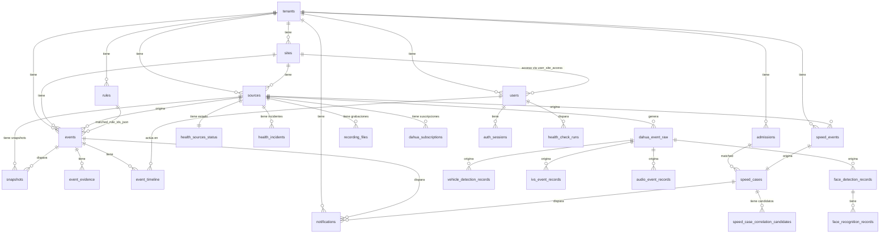

# DATABASE-SPEC.md
## Especificación Completa de Base de Datos — TNS CCTV PWA

*Motor: MySQL 8.0+ · Charset: utf8mb4 · Collation: utf8mb4_unicode_ci*
*Última actualización: 2026-06-08*

---

## 1. Objetivo y Alcance

Este documento es la **fuente de verdad** del esquema de base de datos para el MVP contractual (M1..M14 + S1..S3) y la integración con dispositivos Dahua HTTP API v3.26.

**Cubre:**
- Autenticación y RBAC multi-tenant
- Ingesta de eventos de seguridad desde Edge Connector
- Motor de reglas y workflow de alertas
- Registros de admisiones vehiculares (ANPR + manual)
- Casos de velocidad y correlación
- Notificaciones y outbox asíncrono
- Monitor de salud de fuentes
- Auditoría de API
- Integración Dahua: eventos crudos, detección facial, ANPR, IVS, audio, grabaciones, snapshots

**Fuera de alcance:**
- Analítica predictiva o ML
- Integración ERP/CRM
- Almacenamiento de video (se usan URIs a object storage externo)

---

## 2. Diagrama Entidad-Relación



---

## 3. Tablas Core del MVP

### 3.1 Tenants y Sites

```sql
CREATE TABLE tenants (
  id            CHAR(26)      PRIMARY KEY,
  code          VARCHAR(64)   NOT NULL UNIQUE,
  name          VARCHAR(160)  NOT NULL,
  status        ENUM('ACTIVE','INACTIVE') NOT NULL DEFAULT 'ACTIVE',
  created_at    DATETIME(3)   NOT NULL DEFAULT CURRENT_TIMESTAMP(3),
  updated_at    DATETIME(3)   NOT NULL DEFAULT CURRENT_TIMESTAMP(3) ON UPDATE CURRENT_TIMESTAMP(3)
) ENGINE=InnoDB;

CREATE TABLE sites (
  id            CHAR(26)      PRIMARY KEY,
  tenant_id     CHAR(26)      NOT NULL,
  code          VARCHAR(64)   NOT NULL,
  name          VARCHAR(160)  NOT NULL,
  timezone      VARCHAR(64)   NOT NULL DEFAULT 'America/Santiago',
  status        ENUM('ACTIVE','INACTIVE') NOT NULL DEFAULT 'ACTIVE',
  created_at    DATETIME(3)   NOT NULL DEFAULT CURRENT_TIMESTAMP(3),
  updated_at    DATETIME(3)   NOT NULL DEFAULT CURRENT_TIMESTAMP(3) ON UPDATE CURRENT_TIMESTAMP(3),
  CONSTRAINT fk_sites_tenant  FOREIGN KEY (tenant_id) REFERENCES tenants(id),
  CONSTRAINT uq_sites_code    UNIQUE (tenant_id, code),
  INDEX idx_sites_tenant      (tenant_id, status)
) ENGINE=InnoDB;
```

### 3.2 Usuarios y Acceso

```sql
CREATE TABLE users (
  id            CHAR(26)      PRIMARY KEY,
  tenant_id     CHAR(26)      NOT NULL,
  email         VARCHAR(190)  NOT NULL,
  full_name     VARCHAR(160)  NOT NULL,
  role          ENUM('GUARD','ADMIN','OPS','SUPERADMIN_TNS') NOT NULL,
  password_hash VARCHAR(255)  NOT NULL,
  status        ENUM('ACTIVE','INACTIVE','LOCKED') NOT NULL DEFAULT 'ACTIVE',
  created_at    DATETIME(3)   NOT NULL DEFAULT CURRENT_TIMESTAMP(3),
  updated_at    DATETIME(3)   NOT NULL DEFAULT CURRENT_TIMESTAMP(3) ON UPDATE CURRENT_TIMESTAMP(3),
  CONSTRAINT fk_users_tenant  FOREIGN KEY (tenant_id) REFERENCES tenants(id),
  CONSTRAINT uq_users_email   UNIQUE (tenant_id, email),
  INDEX idx_users_role        (tenant_id, role, status)
) ENGINE=InnoDB;

CREATE TABLE user_site_access (
  user_id       CHAR(26)      NOT NULL,
  site_id       CHAR(26)      NOT NULL,
  granted_at    DATETIME(3)   NOT NULL DEFAULT CURRENT_TIMESTAMP(3),
  PRIMARY KEY (user_id, site_id),
  CONSTRAINT fk_usa_user      FOREIGN KEY (user_id) REFERENCES users(id),
  CONSTRAINT fk_usa_site      FOREIGN KEY (site_id) REFERENCES sites(id)
) ENGINE=InnoDB;

CREATE TABLE auth_sessions (
  id                  CHAR(26)      PRIMARY KEY,
  tenant_id           CHAR(26)      NOT NULL,
  user_id             CHAR(26)      NOT NULL,
  refresh_token_hash  VARCHAR(255)  NOT NULL,
  issued_at           DATETIME(3)   NOT NULL,
  expires_at          DATETIME(3)   NOT NULL,
  revoked_at          DATETIME(3)   NULL,
  created_at          DATETIME(3)   NOT NULL DEFAULT CURRENT_TIMESTAMP(3),
  CONSTRAINT fk_auth_tenant   FOREIGN KEY (tenant_id) REFERENCES tenants(id),
  CONSTRAINT fk_auth_user     FOREIGN KEY (user_id) REFERENCES users(id),
  UNIQUE KEY uq_refresh       (refresh_token_hash),
  INDEX idx_auth_expires      (user_id, expires_at)
) ENGINE=InnoDB;
```

**Roles y permisos:**

| Rol | Descripción | Permisos clave |
|---|---|---|
| `GUARD` | Vigilante de turno | Ver cola, cambiar estado alertas propias, registrar admissions |
| `ADMIN` | Administrador de parque | CRUD completo, reglas, usuarios |
| `OPS` | Operador TNS | Health monitor, speed cases, correlación manual, exportes |
| `SUPERADMIN_TNS` | Soporte TNS | Todo + gestión de tenants |

### 3.3 Fuentes de Eventos

```sql
CREATE TABLE sources (
  id            CHAR(26)      PRIMARY KEY,
  tenant_id     CHAR(26)      NOT NULL,
  site_id       CHAR(26)      NOT NULL,
  source_code   VARCHAR(64)   NOT NULL,
  source_type   ENUM('NVR','CAMERA','ANPR','SPEED_SENSOR','EDGE_CONNECTOR') NOT NULL,
  display_name  VARCHAR(160)  NOT NULL,
  status        ENUM('ACTIVE','INACTIVE') NOT NULL DEFAULT 'ACTIVE',
  metadata_json JSON          NULL,       -- IP, puerto, modelo, firmware, número de serie
  created_at    DATETIME(3)   NOT NULL DEFAULT CURRENT_TIMESTAMP(3),
  updated_at    DATETIME(3)   NOT NULL DEFAULT CURRENT_TIMESTAMP(3) ON UPDATE CURRENT_TIMESTAMP(3),
  CONSTRAINT fk_sources_tenant  FOREIGN KEY (tenant_id) REFERENCES tenants(id),
  CONSTRAINT fk_sources_site    FOREIGN KEY (site_id) REFERENCES sites(id),
  CONSTRAINT uq_sources_code    UNIQUE (tenant_id, source_code),
  INDEX idx_sources_type        (site_id, source_type, status)
) ENGINE=InnoDB;
```

**Campos recomendados en `metadata_json` por tipo:**

| source_type | Campos en metadata_json |
|---|---|
| `NVR` | `ip`, `port`, `model`, `firmware_version`, `serial_no`, `mac`, `http_port`, `rtsp_port`, `channel_count` |
| `CAMERA` | `nvr_source_id`, `channel`, `ip`, `model`, `resolution`, `fps`, `zone_code`, `location_label` |
| `ANPR` | `nvr_source_id`, `channel`, `direction` (entry/exit), `confidence_threshold` |
| `SPEED_SENSOR` | `speed_limit_kph`, `zone_code`, `lane` |
| `EDGE_CONNECTOR` | `version`, `site_lan_ip`, `last_seen_at` |

### 3.4 Idempotencia de Ingesta

```sql
CREATE TABLE ingress_idempotency (
  id              CHAR(26)      PRIMARY KEY,
  tenant_id       CHAR(26)      NOT NULL,
  endpoint_key    VARCHAR(64)   NOT NULL,
  idempotency_key VARCHAR(128)  NOT NULL,
  payload_hash    CHAR(64)      NOT NULL,
  resource_type   ENUM('EVENT','SPEED_EVENT') NOT NULL,
  resource_id     CHAR(26)      NOT NULL,
  first_seen_at   DATETIME(3)   NOT NULL DEFAULT CURRENT_TIMESTAMP(3),
  expires_at      DATETIME(3)   NOT NULL,
  CONSTRAINT fk_idemp_tenant    FOREIGN KEY (tenant_id) REFERENCES tenants(id),
  CONSTRAINT uq_idemp_scope     UNIQUE (tenant_id, endpoint_key, idempotency_key),
  INDEX idx_idemp_expires       (expires_at)
) ENGINE=InnoDB;
```

### 3.5 Reglas Operativas

```sql
CREATE TABLE rules (
  id                  CHAR(26)      PRIMARY KEY,
  tenant_id           CHAR(26)      NOT NULL,
  site_id             CHAR(26)      NULL,
  name                VARCHAR(160)  NOT NULL,
  enabled             TINYINT(1)    NOT NULL DEFAULT 1,
  priority_order      INT           NOT NULL DEFAULT 100,
  conditions_json     JSON          NOT NULL,
  actions_json        JSON          NOT NULL,
  timezone            VARCHAR(64)   NOT NULL DEFAULT 'America/Santiago',
  created_by_user_id  CHAR(26)      NOT NULL,
  updated_by_user_id  CHAR(26)      NOT NULL,
  created_at          DATETIME(3)   NOT NULL DEFAULT CURRENT_TIMESTAMP(3),
  updated_at          DATETIME(3)   NOT NULL DEFAULT CURRENT_TIMESTAMP(3) ON UPDATE CURRENT_TIMESTAMP(3),
  CONSTRAINT fk_rules_tenant      FOREIGN KEY (tenant_id) REFERENCES tenants(id),
  CONSTRAINT fk_rules_site        FOREIGN KEY (site_id) REFERENCES sites(id),
  CONSTRAINT fk_rules_created_by  FOREIGN KEY (created_by_user_id) REFERENCES users(id),
  CONSTRAINT fk_rules_updated_by  FOREIGN KEY (updated_by_user_id) REFERENCES users(id),
  INDEX idx_rules_tenant          (tenant_id, enabled, priority_order)
) ENGINE=InnoDB;
```

**Estructura de `conditions_json` (ejemplo):**
```json
{
  "event_codes": ["CrossLineDetection", "WanderDetection"],
  "zone_codes": ["PERIMETRO_NORTE"],
  "time_window": { "from": "22:00", "to": "06:00" },
  "days_of_week": [1,2,3,4,5,6,7],
  "severity_min": 3
}
```

**Estructura de `actions_json` (ejemplo):**
```json
{
  "criticality": "critica",
  "generate_alert": true,
  "priority_popup": true,
  "notify_roles": ["GUARD", "ADMIN"],
  "record_evidence": true,
  "can_escalate": true,
  "escalation_contacts": ["+56912345678"]
}
```

### 3.6 Eventos y Evidencia

```sql
CREATE TABLE events (
  id                  CHAR(26)      PRIMARY KEY,
  tenant_id           CHAR(26)      NOT NULL,
  site_id             CHAR(26)      NOT NULL,
  source_id           CHAR(26)      NOT NULL,
  external_event_id   VARCHAR(128)  NULL,
  event_type          VARCHAR(64)   NOT NULL,
  severity            TINYINT       NOT NULL,        -- 1-5
  zone_code           VARCHAR(64)   NULL,
  plate               VARCHAR(16)   NULL,
  occurred_at         DATETIME(3)   NOT NULL,
  ingested_at         DATETIME(3)   NOT NULL DEFAULT CURRENT_TIMESTAMP(3),
  state               ENUM('NEW','IN_REVIEW','CLOSED') NOT NULL DEFAULT 'NEW',
  critical            TINYINT(1)    NOT NULL DEFAULT 0,
  priority            INT           NOT NULL DEFAULT 0,
  payload_version     VARCHAR(16)   NOT NULL DEFAULT '1.0',
  raw_payload_json    JSON          NOT NULL,
  matched_rule_ids_json JSON        NULL,
  decision_reason     VARCHAR(255)  NULL,
  request_id          VARCHAR(64)   NULL,
  created_at          DATETIME(3)   NOT NULL DEFAULT CURRENT_TIMESTAMP(3),
  updated_at          DATETIME(3)   NOT NULL DEFAULT CURRENT_TIMESTAMP(3) ON UPDATE CURRENT_TIMESTAMP(3),
  CONSTRAINT fk_events_tenant   FOREIGN KEY (tenant_id) REFERENCES tenants(id),
  CONSTRAINT fk_events_site     FOREIGN KEY (site_id) REFERENCES sites(id),
  CONSTRAINT fk_events_source   FOREIGN KEY (source_id) REFERENCES sources(id),
  INDEX idx_events_queue        (tenant_id, state, priority DESC, occurred_at DESC),
  INDEX idx_events_filters      (tenant_id, site_id, zone_code, event_type, severity, occurred_at DESC),
  INDEX idx_events_plate        (tenant_id, plate, occurred_at DESC),
  INDEX idx_events_request      (request_id)
) ENGINE=InnoDB;

CREATE TABLE event_evidence (
  id              CHAR(26)      PRIMARY KEY,
  tenant_id       CHAR(26)      NOT NULL,
  event_id        CHAR(26)      NOT NULL,
  kind            ENUM('SNAPSHOT','CLIP','IMAGE','VIDEO','OTHER') NOT NULL,
  storage_uri     VARCHAR(1024) NOT NULL,
  mime_type       VARCHAR(128)  NULL,
  sha256          CHAR(64)      NULL,
  captured_at     DATETIME(3)   NULL,
  created_at      DATETIME(3)   NOT NULL DEFAULT CURRENT_TIMESTAMP(3),
  CONSTRAINT fk_ev_tenant   FOREIGN KEY (tenant_id) REFERENCES tenants(id),
  CONSTRAINT fk_ev_event    FOREIGN KEY (event_id) REFERENCES events(id),
  INDEX idx_ev_event        (event_id)
) ENGINE=InnoDB;

CREATE TABLE event_timeline (
  id              CHAR(26)      PRIMARY KEY,
  tenant_id       CHAR(26)      NOT NULL,
  event_id        CHAR(26)      NOT NULL,
  action_type     VARCHAR(64)   NOT NULL,
  from_state      ENUM('NEW','IN_REVIEW','CLOSED') NULL,
  to_state        ENUM('NEW','IN_REVIEW','CLOSED') NULL,
  decision        VARCHAR(128)  NULL,
  comment_text    TEXT          NULL,
  actor_type      ENUM('USER','SYSTEM','CONNECTOR') NOT NULL,
  actor_user_id   CHAR(26)      NULL,
  metadata_json   JSON          NULL,
  occurred_at     DATETIME(3)   NOT NULL DEFAULT CURRENT_TIMESTAMP(3),
  request_id      VARCHAR(64)   NULL,
  CONSTRAINT fk_et_tenant       FOREIGN KEY (tenant_id) REFERENCES tenants(id),
  CONSTRAINT fk_et_event        FOREIGN KEY (event_id) REFERENCES events(id),
  CONSTRAINT fk_et_actor        FOREIGN KEY (actor_user_id) REFERENCES users(id),
  INDEX idx_et_event_time       (event_id, occurred_at ASC),
  INDEX idx_et_tenant_time      (tenant_id, occurred_at DESC)
) ENGINE=InnoDB;
```

**Estados válidos de evento y transiciones:**

```
NEW ──► IN_REVIEW ──► CLOSED
 └───────────────────► CLOSED
```

### 3.7 Admisiones Vehiculares

```sql
CREATE TABLE admissions (
  id                    CHAR(26)      PRIMARY KEY,
  tenant_id             CHAR(26)      NOT NULL,
  site_id               CHAR(26)      NOT NULL,
  plate                 VARCHAR(16)   NULL,
  visitor_id            VARCHAR(64)   NULL,
  visitor_name          VARCHAR(160)  NULL,
  destination_company   VARCHAR(160)  NOT NULL,
  source_type           ENUM('MANUAL','ANPR','HYBRID') NOT NULL,
  entry_at              DATETIME(3)   NOT NULL,
  notes                 TEXT          NULL,
  review_required       TINYINT(1)    NOT NULL DEFAULT 0,
  created_by_user_id    CHAR(26)      NOT NULL,
  updated_by_user_id    CHAR(26)      NULL,
  created_at            DATETIME(3)   NOT NULL DEFAULT CURRENT_TIMESTAMP(3),
  updated_at            DATETIME(3)   NOT NULL DEFAULT CURRENT_TIMESTAMP(3) ON UPDATE CURRENT_TIMESTAMP(3),
  CONSTRAINT fk_adm_tenant      FOREIGN KEY (tenant_id) REFERENCES tenants(id),
  CONSTRAINT fk_adm_site        FOREIGN KEY (site_id) REFERENCES sites(id),
  CONSTRAINT fk_adm_created_by  FOREIGN KEY (created_by_user_id) REFERENCES users(id),
  CONSTRAINT fk_adm_updated_by  FOREIGN KEY (updated_by_user_id) REFERENCES users(id),
  INDEX idx_adm_entry           (tenant_id, entry_at DESC),
  INDEX idx_adm_plate           (tenant_id, plate, entry_at DESC),
  INDEX idx_adm_review          (tenant_id, review_required, entry_at DESC)
) ENGINE=InnoDB;
```

**Fuentes de admisión:**

| source_type | Descripción |
|---|---|
| `MANUAL` | Recepcionista ingresa datos manualmente |
| `ANPR` | Cámara Dahua lee placa automáticamente, confianza alta |
| `HYBRID` | ANPR leyó placa pero recepcionista confirmó/corrigió datos del conductor |

### 3.8 Speed Events y Casos de Velocidad

```sql
CREATE TABLE speed_events (
  id                CHAR(26)      PRIMARY KEY,
  tenant_id         CHAR(26)      NOT NULL,
  site_id           CHAR(26)      NOT NULL,
  source_id         CHAR(26)      NOT NULL,
  external_event_id VARCHAR(128)  NULL,
  plate             VARCHAR(16)   NULL,
  speed_kph         DECIMAL(6,2)  NOT NULL,
  speed_limit_kph   DECIMAL(6,2)  NOT NULL,
  occurred_at       DATETIME(3)   NOT NULL,
  payload_version   VARCHAR(16)   NOT NULL DEFAULT '1.0',
  raw_payload_json  JSON          NOT NULL,
  request_id        VARCHAR(64)   NULL,
  created_at        DATETIME(3)   NOT NULL DEFAULT CURRENT_TIMESTAMP(3),
  CONSTRAINT fk_se_tenant   FOREIGN KEY (tenant_id) REFERENCES tenants(id),
  CONSTRAINT fk_se_site     FOREIGN KEY (site_id) REFERENCES sites(id),
  CONSTRAINT fk_se_source   FOREIGN KEY (source_id) REFERENCES sources(id),
  INDEX idx_se_tenant_time  (tenant_id, occurred_at DESC),
  INDEX idx_se_plate        (tenant_id, plate, occurred_at DESC)
) ENGINE=InnoDB;

CREATE TABLE speed_event_evidence (
  id                CHAR(26)      PRIMARY KEY,
  tenant_id         CHAR(26)      NOT NULL,
  speed_event_id    CHAR(26)      NOT NULL,
  kind              ENUM('SNAPSHOT','CLIP','IMAGE','VIDEO','OTHER') NOT NULL,
  storage_uri       VARCHAR(1024) NOT NULL,
  mime_type         VARCHAR(128)  NULL,
  sha256            CHAR(64)      NULL,
  created_at        DATETIME(3)   NOT NULL DEFAULT CURRENT_TIMESTAMP(3),
  CONSTRAINT fk_see_tenant  FOREIGN KEY (tenant_id) REFERENCES tenants(id),
  CONSTRAINT fk_see_event   FOREIGN KEY (speed_event_id) REFERENCES speed_events(id),
  INDEX idx_see_event       (speed_event_id)
) ENGINE=InnoDB;

CREATE TABLE speed_cases (
  id                          CHAR(26)        PRIMARY KEY,
  tenant_id                   CHAR(26)        NOT NULL,
  site_id                     CHAR(26)        NOT NULL,
  speed_event_id              CHAR(26)        NOT NULL,
  state                       ENUM('OPEN','CORRELATED_AUTO','CORRELATED_MANUAL','CLOSED') NOT NULL DEFAULT 'OPEN',
  correlation_status          ENUM('PENDING','CORRELATED_AUTO','CORRELATED_MANUAL','MANUAL_REVIEW_REQUIRED','NO_MATCH') NOT NULL DEFAULT 'PENDING',
  confidence_score            DECIMAL(5,4)    NULL,           -- 0.0000 a 1.0000
  correlation_window_minutes  INT             NOT NULL DEFAULT 120,
  matched_admission_id        CHAR(26)        NULL,
  manual_review_required      TINYINT(1)      NOT NULL DEFAULT 0,
  correlation_reason          VARCHAR(255)    NULL,
  created_at                  DATETIME(3)     NOT NULL DEFAULT CURRENT_TIMESTAMP(3),
  updated_at                  DATETIME(3)     NOT NULL DEFAULT CURRENT_TIMESTAMP(3) ON UPDATE CURRENT_TIMESTAMP(3),
  CONSTRAINT fk_sc_tenant     FOREIGN KEY (tenant_id) REFERENCES tenants(id),
  CONSTRAINT fk_sc_site       FOREIGN KEY (site_id) REFERENCES sites(id),
  CONSTRAINT fk_sc_event      FOREIGN KEY (speed_event_id) REFERENCES speed_events(id),
  CONSTRAINT fk_sc_adm        FOREIGN KEY (matched_admission_id) REFERENCES admissions(id),
  INDEX idx_sc_state          (tenant_id, state, created_at DESC),
  INDEX idx_sc_correlation    (tenant_id, correlation_status, created_at DESC)
) ENGINE=InnoDB;

CREATE TABLE speed_case_correlation_candidates (
  id              CHAR(26)        PRIMARY KEY,
  tenant_id       CHAR(26)        NOT NULL,
  speed_case_id   CHAR(26)        NOT NULL,
  admission_id    CHAR(26)        NOT NULL,
  score           DECIMAL(5,4)    NOT NULL,
  reason          VARCHAR(255)    NULL,
  selected        TINYINT(1)      NOT NULL DEFAULT 0,
  created_at      DATETIME(3)     NOT NULL DEFAULT CURRENT_TIMESTAMP(3),
  CONSTRAINT fk_scc_tenant  FOREIGN KEY (tenant_id) REFERENCES tenants(id),
  CONSTRAINT fk_scc_case    FOREIGN KEY (speed_case_id) REFERENCES speed_cases(id),
  CONSTRAINT fk_scc_adm     FOREIGN KEY (admission_id) REFERENCES admissions(id),
  CONSTRAINT uq_case_adm    UNIQUE (speed_case_id, admission_id),
  INDEX idx_scc_score       (speed_case_id, score DESC)
) ENGINE=InnoDB;
```

### 3.9 Notificaciones

```sql
CREATE TABLE notifications (
  id                CHAR(26)      PRIMARY KEY,
  tenant_id         CHAR(26)      NOT NULL,
  site_id           CHAR(26)      NOT NULL,
  event_id          CHAR(26)      NULL,
  speed_case_id     CHAR(26)      NULL,
  channel           ENUM('IN_APP','WS','EMAIL_INTERNAL') NOT NULL,
  target_type       ENUM('USER','ROLE','GROUP') NOT NULL,
  target_value      VARCHAR(160)  NOT NULL,
  message_body      TEXT          NOT NULL,
  status            ENUM('QUEUED','SENT','FAILED') NOT NULL DEFAULT 'QUEUED',
  attempts          INT           NOT NULL DEFAULT 0,
  last_attempt_at   DATETIME(3)   NULL,
  sent_at           DATETIME(3)   NULL,
  error_code        VARCHAR(64)   NULL,
  error_message     VARCHAR(255)  NULL,
  created_at        DATETIME(3)   NOT NULL DEFAULT CURRENT_TIMESTAMP(3),
  CONSTRAINT fk_not_tenant  FOREIGN KEY (tenant_id) REFERENCES tenants(id),
  CONSTRAINT fk_not_site    FOREIGN KEY (site_id) REFERENCES sites(id),
  CONSTRAINT fk_not_event   FOREIGN KEY (event_id) REFERENCES events(id),
  CONSTRAINT fk_not_case    FOREIGN KEY (speed_case_id) REFERENCES speed_cases(id),
  INDEX idx_not_status      (tenant_id, status, created_at DESC)
) ENGINE=InnoDB;
```

### 3.10 Salud de Fuentes

```sql
CREATE TABLE health_sources_status (
  id                    CHAR(26)      PRIMARY KEY,
  tenant_id             CHAR(26)      NOT NULL,
  site_id               CHAR(26)      NOT NULL,
  source_id             CHAR(26)      NOT NULL,
  status                ENUM('UP','DEGRADED','DOWN') NOT NULL,
  last_seen_at          DATETIME(3)   NULL,
  consecutive_failures  INT           NOT NULL DEFAULT 0,
  metrics_json          JSON          NULL,    -- latencia, fps, bitrate, etc.
  updated_at            DATETIME(3)   NOT NULL DEFAULT CURRENT_TIMESTAMP(3) ON UPDATE CURRENT_TIMESTAMP(3),
  CONSTRAINT fk_hss_tenant  FOREIGN KEY (tenant_id) REFERENCES tenants(id),
  CONSTRAINT fk_hss_site    FOREIGN KEY (site_id) REFERENCES sites(id),
  CONSTRAINT fk_hss_source  FOREIGN KEY (source_id) REFERENCES sources(id),
  CONSTRAINT uq_hss_source  UNIQUE (tenant_id, source_id),
  INDEX idx_hss_status      (tenant_id, status, updated_at DESC)
) ENGINE=InnoDB;

CREATE TABLE health_incidents (
  id              CHAR(26)      PRIMARY KEY,
  tenant_id       CHAR(26)      NOT NULL,
  site_id         CHAR(26)      NOT NULL,
  source_id       CHAR(26)      NOT NULL,
  status          ENUM('OPEN','ACKED','RESOLVED') NOT NULL DEFAULT 'OPEN',
  opened_at       DATETIME(3)   NOT NULL,
  acknowledged_at DATETIME(3)   NULL,
  resolved_at     DATETIME(3)   NULL,
  title           VARCHAR(180)  NOT NULL,
  details         TEXT          NULL,
  created_at      DATETIME(3)   NOT NULL DEFAULT CURRENT_TIMESTAMP(3),
  updated_at      DATETIME(3)   NOT NULL DEFAULT CURRENT_TIMESTAMP(3) ON UPDATE CURRENT_TIMESTAMP(3),
  CONSTRAINT fk_hi_tenant   FOREIGN KEY (tenant_id) REFERENCES tenants(id),
  CONSTRAINT fk_hi_site     FOREIGN KEY (site_id) REFERENCES sites(id),
  CONSTRAINT fk_hi_source   FOREIGN KEY (source_id) REFERENCES sources(id),
  INDEX idx_hi_status       (tenant_id, status, opened_at DESC)
) ENGINE=InnoDB;

CREATE TABLE health_check_runs (
  id                      CHAR(26)      PRIMARY KEY,
  tenant_id               CHAR(26)      NOT NULL,
  triggered_by_user_id    CHAR(26)      NULL,
  trigger_type            ENUM('SCHEDULER','MANUAL_OPS') NOT NULL,
  status                  ENUM('SCHEDULED','RUNNING','DONE','FAILED') NOT NULL,
  started_at              DATETIME(3)   NULL,
  finished_at             DATETIME(3)   NULL,
  summary_json            JSON          NULL,
  request_id              VARCHAR(64)   NULL,
  created_at              DATETIME(3)   NOT NULL DEFAULT CURRENT_TIMESTAMP(3),
  CONSTRAINT fk_hcr_tenant  FOREIGN KEY (tenant_id) REFERENCES tenants(id),
  CONSTRAINT fk_hcr_user    FOREIGN KEY (triggered_by_user_id) REFERENCES users(id),
  INDEX idx_hcr_status      (tenant_id, status, created_at DESC)
) ENGINE=InnoDB;
```

### 3.11 Auditoría de API

```sql
CREATE TABLE api_audit_log (
  id              CHAR(26)      PRIMARY KEY,
  tenant_id       CHAR(26)      NULL,
  site_id         CHAR(26)      NULL,
  actor_user_id   CHAR(26)      NULL,
  actor_role      VARCHAR(32)   NULL,
  action          VARCHAR(128)  NOT NULL,
  resource_type   VARCHAR(64)   NOT NULL,
  resource_id     CHAR(26)      NULL,
  request_id      VARCHAR(64)   NOT NULL,
  status_code     SMALLINT      NOT NULL,
  details_json    JSON          NULL,
  created_at      DATETIME(3)   NOT NULL DEFAULT CURRENT_TIMESTAMP(3),
  CONSTRAINT fk_audit_tenant  FOREIGN KEY (tenant_id) REFERENCES tenants(id),
  CONSTRAINT fk_audit_site    FOREIGN KEY (site_id) REFERENCES sites(id),
  CONSTRAINT fk_audit_user    FOREIGN KEY (actor_user_id) REFERENCES users(id),
  INDEX idx_audit_request     (request_id),
  INDEX idx_audit_tenant_time (tenant_id, created_at DESC)
) ENGINE=InnoDB;
```

---

## 4. Tablas de Integración Dahua HTTP API v3.26

### 4.1 Flujo de ingesta desde Dahua

```
NVR Dahua
  │
  │ (SSE multipart stream)
  ▼
Edge Connector
  │
  ├─► dahua_event_raw          (persiste TODO antes de procesar)
  │
  ├─► face_detection_records   (si event_code = FaceDetection)
  │       └─► face_recognition_records  (si hay match)
  │
  ├─► vehicle_detection_records (si event_code = TrafficJunction, TrafficOverSpeed, etc.)
  │       └─► CRUCE con admissions.plate (Correlation Engine)
  │
  ├─► ivs_event_records        (si event_code = CrossLineDetection, WanderDetection, etc.)
  │
  ├─► audio_event_records      (si event_code = SmartSoundDetect)
  │
  └─► events                   (evento procesado y normalizado para la cola operativa)
          └─► snapshots        (snapshot adjunto al evento)
```

### 4.2 Eventos Crudos Dahua

```sql
CREATE TABLE dahua_event_raw (
  id              CHAR(26)      PRIMARY KEY,
  tenant_id       CHAR(26)      NOT NULL,
  source_id       CHAR(26)      NOT NULL,
  channel         INT           NOT NULL,
  event_code      VARCHAR(64)   NOT NULL,
  -- Valores posibles: VideoMotion, VideoLoss, VideoBlind, FaceDetection,
  -- FaceRecognition, TrafficJunction, TrafficOverSpeed, TrafficRetrograde,
  -- TrafficParking, TrafficPedestrain, CrossLineDetection, CrossRegionDetection,
  -- WanderDetection, LeftDetection, TakenAwayDetection, SmartMotionHuman,
  -- SmartMotionVehicle, AlarmLocal, StorageFailure, StorageLowSpace,
  -- StorageNotExist, LoginFailureAlarm, NetAbort, IPConflict, SmartSoundDetect
  action          ENUM('Start','Stop','Pulse') NOT NULL,
  received_at     DATETIME(3)   NOT NULL,
  payload_json    JSON          NOT NULL,
  processed       TINYINT(1)    NOT NULL DEFAULT 0,
  linked_event_id CHAR(26)      NULL,
  created_at      DATETIME(3)   NOT NULL DEFAULT CURRENT_TIMESTAMP(3),
  CONSTRAINT fk_dhr_tenant  FOREIGN KEY (tenant_id) REFERENCES tenants(id),
  CONSTRAINT fk_dhr_source  FOREIGN KEY (source_id) REFERENCES sources(id),
  CONSTRAINT fk_dhr_event   FOREIGN KEY (linked_event_id) REFERENCES events(id),
  INDEX idx_dhr_tenant_time (tenant_id, received_at DESC),
  INDEX idx_dhr_code_time   (source_id, event_code, received_at DESC),
  INDEX idx_dhr_pending     (processed, received_at ASC)
) ENGINE=InnoDB;
```

### 4.3 Detección y Reconocimiento Facial

```sql
CREATE TABLE face_detection_records (
  id                  CHAR(26)      PRIMARY KEY,
  tenant_id           CHAR(26)      NOT NULL,
  dahua_event_raw_id  CHAR(26)      NOT NULL,
  source_id           CHAR(26)      NOT NULL,
  channel             INT           NOT NULL,
  detected_at         DATETIME(3)   NOT NULL,
  sex                 ENUM('Man','Woman','Unknown') NOT NULL DEFAULT 'Unknown',
  age                 TINYINT UNSIGNED NULL,
  has_glasses         TINYINT(1)    NULL,   -- NULL = no detectado; 0 = no; 1 = sí
  has_mask            TINYINT(1)    NULL,
  has_beard           TINYINT(1)    NULL,
  snapshot_path       VARCHAR(512)  NULL,   -- URI en object storage
  created_at          DATETIME(3)   NOT NULL DEFAULT CURRENT_TIMESTAMP(3),
  CONSTRAINT fk_fdr_tenant  FOREIGN KEY (tenant_id) REFERENCES tenants(id),
  CONSTRAINT fk_fdr_raw     FOREIGN KEY (dahua_event_raw_id) REFERENCES dahua_event_raw(id),
  CONSTRAINT fk_fdr_source  FOREIGN KEY (source_id) REFERENCES sources(id),
  INDEX idx_fdr_time        (tenant_id, detected_at DESC),
  INDEX idx_fdr_source      (source_id, detected_at DESC)
) ENGINE=InnoDB;

CREATE TABLE face_recognition_records (
  id                CHAR(26)        PRIMARY KEY,
  tenant_id         CHAR(26)        NOT NULL,
  detection_id      CHAR(26)        NOT NULL,
  rec_result        TINYINT(1)      NOT NULL,         -- 0=sin match; 1=match exitoso
  similarity        TINYINT UNSIGNED NULL,             -- 0-100
  person_name       VARCHAR(128)    NULL,
  person_id         VARCHAR(64)     NULL,              -- ID en base de datos del NVR
  person_group_id   VARCHAR(64)     NULL,
  certificate_type  ENUM('IC','Passport','Unknown') NULL,
  scene_image_path  VARCHAR(512)    NULL,
  created_at        DATETIME(3)     NOT NULL DEFAULT CURRENT_TIMESTAMP(3),
  CONSTRAINT fk_frr_tenant      FOREIGN KEY (tenant_id) REFERENCES tenants(id),
  CONSTRAINT fk_frr_detection   FOREIGN KEY (detection_id) REFERENCES face_detection_records(id),
  INDEX idx_frr_person          (tenant_id, person_id),
  INDEX idx_frr_detection       (detection_id)
) ENGINE=InnoDB;
```

### 4.4 Detección Vehicular y ANPR

```sql
CREATE TABLE vehicle_detection_records (
  id                  CHAR(26)      PRIMARY KEY,
  tenant_id           CHAR(26)      NOT NULL,
  dahua_event_raw_id  CHAR(26)      NOT NULL,
  source_id           CHAR(26)      NOT NULL,
  channel             INT           NOT NULL,
  detected_at         DATETIME(3)   NOT NULL,
  plate_number        VARCHAR(16)   NULL,   -- patente leída (cruzar con admissions.plate)
  plate_type          VARCHAR(32)   NULL,   -- Yellow, Blue, Black, White, etc.
  plate_color         VARCHAR(32)   NULL,
  vehicle_color       VARCHAR(32)   NULL,   -- White, Black, Silver, Red, etc.
  country_code        CHAR(2)       NULL,   -- ISO 3166-1 alpha-2
  speed_kmh           SMALLINT UNSIGNED NULL,
  traffic_event       VARCHAR(64)   NULL,   -- TrafficJunction, TrafficOverSpeed, TrafficRetrograde, etc.
  snapshot_path       VARCHAR(512)  NULL,
  created_at          DATETIME(3)   NOT NULL DEFAULT CURRENT_TIMESTAMP(3),
  CONSTRAINT fk_vdr_tenant  FOREIGN KEY (tenant_id) REFERENCES tenants(id),
  CONSTRAINT fk_vdr_raw     FOREIGN KEY (dahua_event_raw_id) REFERENCES dahua_event_raw(id),
  CONSTRAINT fk_vdr_source  FOREIGN KEY (source_id) REFERENCES sources(id),
  INDEX idx_vdr_plate       (tenant_id, plate_number, detected_at DESC),
  INDEX idx_vdr_source      (source_id, detected_at DESC)
) ENGINE=InnoDB;
```

> **Cruce ANPR ↔ Admissions:** `vehicle_detection_records.plate_number` se compara con `admissions.plate` dentro de una ventana temporal configurable. Si hay match, la admission puede crearse automáticamente con `source_type = 'ANPR'`.

### 4.5 Eventos IVS (Analítica de Video Inteligente)

```sql
CREATE TABLE ivs_event_records (
  id                  CHAR(26)      PRIMARY KEY,
  tenant_id           CHAR(26)      NOT NULL,
  dahua_event_raw_id  CHAR(26)      NOT NULL,
  source_id           CHAR(26)      NOT NULL,
  channel             INT           NOT NULL,
  triggered_at        DATETIME(3)   NOT NULL,
  rule_name           VARCHAR(128)  NULL,   -- nombre de la regla en el NVR
  rule_type           VARCHAR(64)   NOT NULL,
  -- Valores: CrossLineDetection, CrossRegionDetection, LeftDetection,
  -- WanderDetection, MoveDetection, TakenAwayDetection, StayDetection,
  -- TailDetection, PasteDetection, CrossFenceDetection
  action              VARCHAR(32)   NOT NULL,  -- Appear, Disappear, Inside, Cross
  object_type         VARCHAR(32)   NULL,       -- Human, Vehicle, NonMotor, Unknown
  created_at          DATETIME(3)   NOT NULL DEFAULT CURRENT_TIMESTAMP(3),
  CONSTRAINT fk_ivs_tenant  FOREIGN KEY (tenant_id) REFERENCES tenants(id),
  CONSTRAINT fk_ivs_raw     FOREIGN KEY (dahua_event_raw_id) REFERENCES dahua_event_raw(id),
  CONSTRAINT fk_ivs_source  FOREIGN KEY (source_id) REFERENCES sources(id),
  INDEX idx_ivs_time        (tenant_id, triggered_at DESC),
  INDEX idx_ivs_rule_type   (source_id, rule_type, triggered_at DESC)
) ENGINE=InnoDB;
```

### 4.6 Eventos de Análisis de Audio

```sql
CREATE TABLE audio_event_records (
  id                  CHAR(26)      PRIMARY KEY,
  tenant_id           CHAR(26)      NOT NULL,
  dahua_event_raw_id  CHAR(26)      NOT NULL,
  source_id           CHAR(26)      NOT NULL,
  channel             INT           NOT NULL,
  detected_at         DATETIME(3)   NOT NULL,
  sound_type          VARCHAR(64)   NOT NULL,
  -- Valores: AudioCry, AudioAlarm, AudioGunshot, AudioExplosion,
  -- AudioScream, AudioCrashingGlass
  intensity_threshold TINYINT UNSIGNED NULL,  -- 1-100
  created_at          DATETIME(3)   NOT NULL DEFAULT CURRENT_TIMESTAMP(3),
  CONSTRAINT fk_aer_tenant  FOREIGN KEY (tenant_id) REFERENCES tenants(id),
  CONSTRAINT fk_aer_raw     FOREIGN KEY (dahua_event_raw_id) REFERENCES dahua_event_raw(id),
  CONSTRAINT fk_aer_source  FOREIGN KEY (source_id) REFERENCES sources(id),
  INDEX idx_aer_time        (tenant_id, detected_at DESC),
  INDEX idx_aer_type        (source_id, sound_type, detected_at DESC)
) ENGINE=InnoDB;
```

### 4.7 Archivos de Grabación

```sql
CREATE TABLE recording_files (
  id                CHAR(26)      PRIMARY KEY,
  tenant_id         CHAR(26)      NOT NULL,
  source_id         CHAR(26)      NOT NULL,
  channel           INT           NOT NULL,
  start_time        DATETIME      NOT NULL,
  end_time          DATETIME      NOT NULL,
  file_type         ENUM('dav','mp4','jpg') NOT NULL,
  video_stream      ENUM('Main','Extra1','Extra2','Extra3') NOT NULL DEFAULT 'Main',
  file_path         VARCHAR(512)  NOT NULL,       -- ruta en el NVR
  duration_seconds  SMALLINT UNSIGNED NULL,
  file_size_bytes   INT UNSIGNED  NULL,
  events_json       JSON          NULL,            -- array de event_codes en el clip
  fetched_at        DATETIME(3)   NOT NULL DEFAULT CURRENT_TIMESTAMP(3),
  CONSTRAINT fk_rf_tenant   FOREIGN KEY (tenant_id) REFERENCES tenants(id),
  CONSTRAINT fk_rf_source   FOREIGN KEY (source_id) REFERENCES sources(id),
  CONSTRAINT uq_rf_path     UNIQUE (source_id, file_path),
  INDEX idx_rf_time         (tenant_id, start_time DESC),
  INDEX idx_rf_source_time  (source_id, start_time DESC)
) ENGINE=InnoDB;
```

### 4.8 Snapshots

```sql
CREATE TABLE snapshots (
  id                CHAR(26)      PRIMARY KEY,
  tenant_id         CHAR(26)      NOT NULL,
  source_id         CHAR(26)      NOT NULL,
  event_id          CHAR(26)      NULL,    -- FK a events si fue disparado por evento
  channel           INT           NOT NULL,
  captured_at       DATETIME(3)   NOT NULL,
  trigger           ENUM('ON_DEMAND','EVENT','SCHEDULED') NOT NULL,
  storage_uri       VARCHAR(1024) NOT NULL,
  mime_type         VARCHAR(64)   NULL,
  sha256            CHAR(64)      NULL,
  width_px          SMALLINT UNSIGNED NULL,
  height_px         SMALLINT UNSIGNED NULL,
  file_size_bytes   INT UNSIGNED  NULL,
  created_at        DATETIME(3)   NOT NULL DEFAULT CURRENT_TIMESTAMP(3),
  CONSTRAINT fk_snap_tenant   FOREIGN KEY (tenant_id) REFERENCES tenants(id),
  CONSTRAINT fk_snap_source   FOREIGN KEY (source_id) REFERENCES sources(id),
  CONSTRAINT fk_snap_event    FOREIGN KEY (event_id) REFERENCES events(id),
  INDEX idx_snap_time         (tenant_id, captured_at DESC),
  INDEX idx_snap_source_time  (source_id, captured_at DESC),
  INDEX idx_snap_event        (event_id)
) ENGINE=InnoDB;
```

### 4.9 Suscripciones SSE Dahua

```sql
CREATE TABLE dahua_subscriptions (
  id                  CHAR(26)      PRIMARY KEY,
  tenant_id           CHAR(26)      NOT NULL,
  source_id           CHAR(26)      NOT NULL,   -- NVR o EDGE_CONNECTOR
  channel             INT           NULL,        -- NULL = todos los canales
  event_codes_json    JSON          NOT NULL,    -- array de event_codes suscritos
  status              ENUM('ACTIVE','INACTIVE','ERROR') NOT NULL DEFAULT 'ACTIVE',
  last_heartbeat_at   DATETIME(3)   NULL,
  error_message       VARCHAR(255)  NULL,
  created_at          DATETIME(3)   NOT NULL DEFAULT CURRENT_TIMESTAMP(3),
  updated_at          DATETIME(3)   NOT NULL DEFAULT CURRENT_TIMESTAMP(3) ON UPDATE CURRENT_TIMESTAMP(3),
  CONSTRAINT fk_dsub_tenant   FOREIGN KEY (tenant_id) REFERENCES tenants(id),
  CONSTRAINT fk_dsub_source   FOREIGN KEY (source_id) REFERENCES sources(id),
  INDEX idx_dsub_status       (tenant_id, status, updated_at DESC)
) ENGINE=InnoDB;
```

---

## 5. Mapeo Campo Dahua → Columna BD

| API Dahua | Tabla BD | Columna BD | Notas |
|---|---|---|---|
| `Camera.DeviceID` | `sources` | `metadata_json.device_id` | ID único Dahua |
| `Camera.DeviceInfo.Address` | `sources` | `metadata_json.ip` | IP del NVR |
| `Camera.DeviceInfo.Port` | `sources` | `metadata_json.port` | Puerto HTTP |
| `Camera.DeviceInfo.SerialNo` | `sources` | `metadata_json.serial_no` | Número de serie |
| `Camera.DeviceInfo.SoftwareVersion` | `sources` | `metadata_json.firmware_version` | Versión firmware |
| `Camera.Channel` | `sources` / `dahua_event_raw` | `metadata_json.channel` / `channel` | Canal del NVR |
| `EventBaseInfo.Code` | `dahua_event_raw` | `event_code` | Código del evento |
| `EventBaseInfo.Action` | `dahua_event_raw` | `action` | Start/Stop/Pulse |
| `EventBaseInfo.Index` | `dahua_event_raw` | `channel` | Canal del evento |
| `FaceDetectionRecord.Sex` | `face_detection_records` | `sex` | Man/Woman/Unknown |
| `FaceDetectionRecord.Age` | `face_detection_records` | `age` | Edad estimada |
| `FaceDetectionRecord.Glasses` | `face_detection_records` | `has_glasses` | 0=unknown→NULL |
| `FaceDetectionRecord.Mask` | `face_detection_records` | `has_mask` | 0=unknown→NULL |
| `FaceDetectionRecord.Beard` | `face_detection_records` | `has_beard` | 0=unknown→NULL |
| `FaceRecognitionRecord.RecResult` | `face_recognition_records` | `rec_result` | 0=failed, 1=success |
| `FaceRecognitionRecord.Candidates[0].Similarity` | `face_recognition_records` | `similarity` | 0-100 |
| `FaceRecognitionRecord.Candidates[0].Person.Name` | `face_recognition_records` | `person_name` | Nombre en BD NVR |
| `FaceRecognitionRecord.Candidates[0].Person.ID` | `face_recognition_records` | `person_id` | ID en BD NVR |
| `TrafficCar.PlateNumber` | `vehicle_detection_records` | `plate_number` | Patente ANPR |
| `TrafficCar.PlateColor` | `vehicle_detection_records` | `plate_color` | Color de placa |
| `TrafficCar.VehicleColor` | `vehicle_detection_records` | `vehicle_color` | Color de vehículo |
| `TrafficCar.Speed` | `vehicle_detection_records` | `speed_kmh` | Velocidad en km/h |
| `TrafficCar.Event` | `vehicle_detection_records` | `traffic_event` | Tipo de infracción |
| `IVS.Rule` | `ivs_event_records` | `rule_type` | Tipo de regla IVS |
| `IVS.Action` | `ivs_event_records` | `action` | Appear/Inside/Cross |
| `IVS.ObjectType` | `ivs_event_records` | `object_type` | Human/Vehicle/etc. |
| `AudioAnalyse.Rules[].Config.Types[]` | `audio_event_records` | `sound_type` | Tipo de sonido |
| `findNextFile.items[].FilePath` | `recording_files` | `file_path` | Ruta en NVR |
| `findNextFile.items[].StartTime` | `recording_files` | `start_time` | Inicio grabación |
| `findNextFile.items[].EndTime` | `recording_files` | `end_time` | Fin grabación |
| `findNextFile.items[].Duration` | `recording_files` | `duration_seconds` | Duración en seg |
| `snapshot.cgi` (binario JPEG) | `snapshots` | `storage_uri` | Almacenado en object storage |

---

## 6. Índices por Caso de Uso

| Caso de uso | Tabla | Índice |
|---|---|---|
| Cola operativa de alertas | `events` | `idx_events_queue` (tenant, state, priority, time) |
| Filtros de cola | `events` | `idx_events_filters` (tenant, site, zone, type, severity, time) |
| Búsqueda por patente en alertas | `events` | `idx_events_plate` |
| Búsqueda por patente en ANPR | `vehicle_detection_records` | `idx_vdr_plate` |
| Búsqueda por patente en admissions | `admissions` | `idx_adm_plate` |
| Búsqueda por patente en speed events | `speed_events` | `idx_se_plate` |
| Timeline de un evento | `event_timeline` | `idx_et_event_time` |
| Cola de procesamiento pendiente | `dahua_event_raw` | `idx_dhr_pending` |
| Estado de salud de fuentes | `health_sources_status` | `idx_hss_status` |
| Incidentes abiertos | `health_incidents` | `idx_hi_status` |
| Notificaciones pendientes de envío | `notifications` | `idx_not_status` |
| Auditoría por request_id | `api_audit_log` | `idx_audit_request` |
| Grabaciones por canal y tiempo | `recording_files` | `idx_rf_source_time` |
| Reconocimiento facial por persona | `face_recognition_records` | `idx_frr_person` |

---

## 7. Reglas de Integridad

1. **Multi-tenancy:** Toda query de negocio debe filtrar por `tenant_id`. Nunca seleccionar filas sin este filtro.
2. **Idempotencia:** Key repetida con payload_hash diferente retorna `IDEMPOTENCY_CONFLICT` (HTTP 409).
3. **Transiciones de estado:** Validar contra estado actual antes de actualizar. Toda transición se audita en `event_timeline`.
4. **Correlación manual:** Requiere `correlation_reason` no nulo y registro en `event_timeline` con `actor_type = 'USER'`.
5. **Evidencia Dahua:** Todo snapshot/clip referenciado desde `event_evidence` o `snapshots` se almacena en object storage antes de insertar la URI.
6. **Suscripciones SSE:** Una fila por `(source_id, channel)`. Reconexión actualiza `last_heartbeat_at` sin crear nueva fila.
7. **PKs ULID:** Todas las PKs son `CHAR(26)` en formato ULID (ordenables por tiempo, únicos globalmente).

---

## 8. Estrategia de Particionamiento

Las tablas de alto volumen se particionan por mes sobre la columna de timestamp principal:

```sql
-- Ejemplo para events (aplicar también a dahua_event_raw, vehicle_detection_records)
ALTER TABLE events
  PARTITION BY RANGE (YEAR(occurred_at) * 100 + MONTH(occurred_at)) (
    PARTITION p202606 VALUES LESS THAN (202607),
    PARTITION p202607 VALUES LESS THAN (202608),
    PARTITION p202608 VALUES LESS THAN (202609),
    PARTITION p_future VALUES LESS THAN MAXVALUE
  );
```

Tablas candidatas a particionamiento:
- `events` (por `occurred_at`)
- `dahua_event_raw` (por `received_at`)
- `vehicle_detection_records` (por `detected_at`)
- `face_detection_records` (por `detected_at`)
- `ivs_event_records` (por `triggered_at`)
- `api_audit_log` (por `created_at`)

---

## 9. Política de Retención de Datos

| Tabla / Tipo de dato | Retención | Estrategia |
|---|---|---|
| `events` (core) | Indefinido | No eliminar |
| `event_evidence` (snapshots, clips) | 90 días | Eliminar objeto de storage + fila |
| `event_timeline` | 12 meses | Archivar a cold storage |
| `api_audit_log` | 12 meses | Archivar a cold storage |
| `dahua_event_raw` (procesados) | 30 días | Purgar filas con `processed = 1` |
| `face_detection_records` | 90 días | Eliminar junto con snapshot |
| `vehicle_detection_records` | 90 días | Eliminar junto con snapshot |
| `recording_files` | 90 días | Eliminar archivo en NVR + fila |
| `snapshots` (objeto de storage) | 90 días | Eliminar objeto + fila |
| `auth_sessions` (expiradas) | 7 días tras expiración | Purgar periódicamente |
| `ingress_idempotency` | Según `expires_at` | Purgar vía job diario |

---

## 10. Convenciones de Nomenclatura

| Elemento | Convención | Ejemplo |
|---|---|---|
| Tablas | snake_case plural | `speed_events` |
| Columnas | snake_case | `created_at` |
| PKs | `CHAR(26)` ULID | `id` |
| FKs | `fk_<tabla_corta>_<ref>` | `fk_events_tenant` |
| Índices únicos | `uq_<tabla>_<campo(s)>` | `uq_sources_code` |
| Índices de búsqueda | `idx_<tabla>_<propósito>` | `idx_events_queue` |
| Timestamps | `DATETIME(3)` UTC | `occurred_at`, `created_at` |
| Flags booleanos | `TINYINT(1)` | `enabled`, `processed` |
| JSON flexible | `JSON` NOT NULL o NULL según requerimiento | `metadata_json`, `payload_json` |
