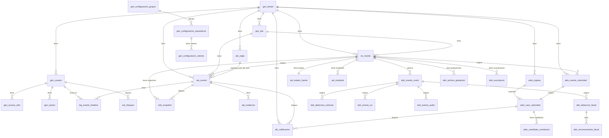

# DATABASE-SPEC.md
## Especificación Completa de Base de Datos — TNS CCTV PWA

*Motor: MySQL 8.0+ · Charset: utf8mb4 · Collation: utf8mb4_unicode_ci*
*Estándar: The-Next-Security/estandares-generales*
*Última actualización: 2026-06-08*

---

## 1. Objetivo y Alcance

Este documento es la **fuente de verdad** del esquema de base de datos para el MVP contractual (M1..M14 + S1..S3) y la integración con dispositivos Dahua HTTP API v3.26.

**Cubre:**
- Autenticación y RBAC multi-tenant
- Configuración centralizada del sistema desde BD
- Ingesta de eventos de seguridad desde Edge Connector
- Motor de reglas y workflow de alertas
- Registros de admisiones vehiculares (ANPR + manual)
- Casos de velocidad y correlación
- Notificaciones y outbox asíncrono
- Monitor de salud de fuentes
- Auditoría de API
- Integración Dahua: eventos crudos, detección facial, ANPR, IVS, audio, grabaciones, snapshots

**Fuera de alcance:**
- Analítica predictiva o ML
- Integración ERP/CRM
- Almacenamiento de video (se usan URIs a object storage externo)

---

## 2. Sistema de Prefijos de Tablas

Conforme al estándar organizacional `The-Next-Security/estandares-generales/estandares/BasesDeDatos.md`.

| Prefijo | Módulo | Descripción |
|---------|--------|-------------|
| `gen_` | General | ⚠️ OBLIGATORIO — Tenants, sites, usuarios, sesiones, configuración global |
| `log_` | Auditoría | Timeline de eventos, logs de operaciones API |
| `ale_` | Alertas | Eventos de seguridad, evidencia, reglas, notificaciones |
| `src_` | Fuentes/Dispositivos | Cámaras, NVR, ANPR, sensores, conectores edge, idempotencia |
| `sal_` | Salud | Estado de fuentes, incidentes, chequeos de salud |
| `adm_` | Admisiones | Ingresos vehiculares, speed events, correlación |
| `dah_` | Dahua | Integración Dahua HTTP API v3.26 |

### Convenciones de nomenclatura

- **Tablas:** `prefijo_nombre_descriptivo_snake_case`
- **PKs:** `id_{tabla_sin_prefijo}` — tipo `CHAR(26)` ULID (ver ADR abajo)
- **FKs (columna):** mismo nombre que la PK referenciada (`id_tenant`, `id_usuario`, etc.)
- **FKs (constraint):** `fk_{tabla_origen}_{col_origen}_{tabla_destino}_{col_dest}`
- **Índices únicos:** `uk_{tabla_sin_prefijo}_{col(s)}`
- **Índices búsqueda:** `idx_{tabla_sin_prefijo}_{propósito_o_cols}`
- **Funciones:** `fun_descripcion`
- **Stored Procedures:** `stpr_descripcion`
- **Eventos (scheduler):** `evt_descripcion`
- **Triggers:** `trig_descripcion`

### ADR: PKs ULID en lugar de INT AUTO_INCREMENT

El estándar organizacional recomienda `INT AUTO_INCREMENT`. Este proyecto usa `CHAR(26)` ULID porque:
- Los ULIDs son únicos globalmente sin coordinación central (necesario para Edge Connectors distribuidos)
- Son ordenables por tiempo, lo que permite paginación eficiente
- Eliminan conflictos de ID entre tenants en un esquema multi-tenant

**Decisión:** Se mantienen ULIDs para todas las PKs de dominio. Las PKs de las tablas `gen_configuracion_*` usan `INT AUTO_INCREMENT` (no son entidades distribuidas).

---

## 3. Diagrama Entidad-Relación



---

## 4. Tablas `gen_` — General

### 4.1 Tenants y Sites

```sql
CREATE TABLE gen_tenant (
  id_tenant     CHAR(26)      PRIMARY KEY,
  code          VARCHAR(64)   NOT NULL UNIQUE,
  name          VARCHAR(160)  NOT NULL,
  status        ENUM('ACTIVE','INACTIVE') NOT NULL DEFAULT 'ACTIVE',
  creado_en     DATETIME(3)   NOT NULL DEFAULT CURRENT_TIMESTAMP(3),
  actualizado_en DATETIME(3)  NOT NULL DEFAULT CURRENT_TIMESTAMP(3) ON UPDATE CURRENT_TIMESTAMP(3)
) ENGINE=InnoDB;

CREATE TABLE gen_site (
  id_site       CHAR(26)      PRIMARY KEY,
  id_tenant     CHAR(26)      NOT NULL,
  code          VARCHAR(64)   NOT NULL,
  name          VARCHAR(160)  NOT NULL,
  timezone      VARCHAR(64)   NOT NULL DEFAULT 'America/Santiago',
  status        ENUM('ACTIVE','INACTIVE') NOT NULL DEFAULT 'ACTIVE',
  creado_en     DATETIME(3)   NOT NULL DEFAULT CURRENT_TIMESTAMP(3),
  actualizado_en DATETIME(3)  NOT NULL DEFAULT CURRENT_TIMESTAMP(3) ON UPDATE CURRENT_TIMESTAMP(3),
  CONSTRAINT fk_gen_site_id_tenant_gen_tenant_id_tenant
    FOREIGN KEY (id_tenant) REFERENCES gen_tenant(id_tenant),
  CONSTRAINT uk_site_tenant_code UNIQUE (id_tenant, code),
  INDEX idx_site_tenant_status (id_tenant, status)
) ENGINE=InnoDB;
```

### 4.2 Usuarios y Acceso

```sql
CREATE TABLE gen_usuario (
  id_usuario    CHAR(26)      PRIMARY KEY,
  id_tenant     CHAR(26)      NOT NULL,
  email         VARCHAR(190)  NOT NULL,
  full_name     VARCHAR(160)  NOT NULL,
  role          ENUM('GUARD','ADMIN','OPS','SUPERADMIN_TNS') NOT NULL,
  password_hash VARCHAR(255)  NOT NULL,
  status        ENUM('ACTIVE','INACTIVE','LOCKED') NOT NULL DEFAULT 'ACTIVE',
  creado_en     DATETIME(3)   NOT NULL DEFAULT CURRENT_TIMESTAMP(3),
  actualizado_en DATETIME(3)  NOT NULL DEFAULT CURRENT_TIMESTAMP(3) ON UPDATE CURRENT_TIMESTAMP(3),
  CONSTRAINT fk_gen_usuario_id_tenant_gen_tenant_id_tenant
    FOREIGN KEY (id_tenant) REFERENCES gen_tenant(id_tenant),
  CONSTRAINT uk_usuario_tenant_email UNIQUE (id_tenant, email),
  INDEX idx_usuario_tenant_role_status (id_tenant, role, status)
) ENGINE=InnoDB;

CREATE TABLE gen_acceso_sitio (
  id_usuario    CHAR(26)      NOT NULL,
  id_site       CHAR(26)      NOT NULL,
  granted_at    DATETIME(3)   NOT NULL DEFAULT CURRENT_TIMESTAMP(3),
  PRIMARY KEY (id_usuario, id_site),
  CONSTRAINT fk_gen_acceso_sitio_id_usuario_gen_usuario_id_usuario
    FOREIGN KEY (id_usuario) REFERENCES gen_usuario(id_usuario),
  CONSTRAINT fk_gen_acceso_sitio_id_site_gen_site_id_site
    FOREIGN KEY (id_site) REFERENCES gen_site(id_site)
) ENGINE=InnoDB;

CREATE TABLE gen_sesion (
  id_sesion           CHAR(26)      PRIMARY KEY,
  id_tenant           CHAR(26)      NOT NULL,
  id_usuario          CHAR(26)      NOT NULL,
  refresh_token_hash  VARCHAR(255)  NOT NULL,
  issued_at           DATETIME(3)   NOT NULL,
  expires_at          DATETIME(3)   NOT NULL,
  revoked_at          DATETIME(3)   NULL,
  creado_en           DATETIME(3)   NOT NULL DEFAULT CURRENT_TIMESTAMP(3),
  CONSTRAINT fk_gen_sesion_id_tenant_gen_tenant_id_tenant
    FOREIGN KEY (id_tenant) REFERENCES gen_tenant(id_tenant),
  CONSTRAINT fk_gen_sesion_id_usuario_gen_usuario_id_usuario
    FOREIGN KEY (id_usuario) REFERENCES gen_usuario(id_usuario),
  UNIQUE KEY uk_sesion_refresh_hash (refresh_token_hash),
  INDEX idx_sesion_usuario_expires (id_usuario, expires_at)
) ENGINE=InnoDB;
```

**Roles y permisos:**

| Rol | Descripción | Permisos clave |
|---|---|---|
| `GUARD` | Vigilante de turno | Ver cola, cambiar estado alertas propias, registrar admissions |
| `ADMIN` | Administrador de parque | CRUD completo, reglas, usuarios |
| `OPS` | Operador TNS | Health monitor, speed cases, correlación manual, exportes |
| `SUPERADMIN_TNS` | Soporte TNS | Todo + gestión de tenants |

### 4.3 Configuración del Sistema

Toda configuración de runtime se almacena aquí. El sistema arranca leyendo `connection-config.json` (gitignored) para conectarse, luego carga el resto desde estas tablas.

```sql
CREATE TABLE gen_configuracion_grupos (
  id_configuracion_grupos INT           PRIMARY KEY AUTO_INCREMENT,
  nombre                  VARCHAR(50)   NOT NULL UNIQUE,
  descripcion             TEXT          NULL,
  orden                   INT           NOT NULL DEFAULT 0,
  activo                  TINYINT(1)    NOT NULL DEFAULT 1,
  creado_en               DATETIME      NOT NULL DEFAULT CURRENT_TIMESTAMP,
  actualizado_en          DATETIME      NOT NULL DEFAULT CURRENT_TIMESTAMP ON UPDATE CURRENT_TIMESTAMP
) ENGINE=InnoDB;

CREATE TABLE gen_configuracion_parametros (
  id_configuracion_parametros INT           PRIMARY KEY AUTO_INCREMENT,
  id_configuracion_grupos     INT           NOT NULL,
  ruta_completa               VARCHAR(255)  NOT NULL UNIQUE,
  nombre_parametro            VARCHAR(100)  NOT NULL,
  es_sensible                 TINYINT(1)    NOT NULL DEFAULT 0,
  es_requerido                TINYINT(1)    NOT NULL DEFAULT 0,
  valor_default               TEXT          NULL,
  activo                      TINYINT(1)    NOT NULL DEFAULT 1,
  CONSTRAINT fk_gen_conf_param_id_conf_grupos_gen_conf_grupos_id_conf_grupos
    FOREIGN KEY (id_configuracion_grupos)
    REFERENCES gen_configuracion_grupos(id_configuracion_grupos),
  INDEX idx_configuracion_parametros_ruta (ruta_completa),
  INDEX idx_configuracion_parametros_id_grupos-activo (id_configuracion_grupos, activo)
) ENGINE=InnoDB;

CREATE TABLE gen_configuracion_valores (
  id_configuracion_valores    INT           PRIMARY KEY AUTO_INCREMENT,
  id_configuracion_parametros INT           NOT NULL,
  valor                       TEXT          NOT NULL,
  version                     INT           NOT NULL DEFAULT 1,
  activo                      TINYINT(1)    NOT NULL DEFAULT 1,
  valido_desde                DATETIME      NOT NULL DEFAULT CURRENT_TIMESTAMP,
  valido_hasta                DATETIME      NULL,
  CONSTRAINT fk_gen_conf_valores_id_conf_param_gen_conf_param_id_conf_param
    FOREIGN KEY (id_configuracion_parametros)
    REFERENCES gen_configuracion_parametros(id_configuracion_parametros),
  CONSTRAINT uk_configuracion_valores_parametro_activo
    UNIQUE (id_configuracion_parametros, activo),
  INDEX idx_configuracion_valores_id_param-activo (id_configuracion_parametros, activo)
) ENGINE=InnoDB;
```

**Grupos de configuración del proyecto:**

| Grupo | Parámetros (`ruta_completa`) | Sensible |
|---|---|---|
| `jwt` | `jwt.secret`, `jwt.refresh_secret`, `jwt.expires_in`, `jwt.refresh_expires_in` | Sí / Sí / No / No |
| `system` | `system.environment`, `system.timezone`, `system.port` | No |
| `api` | `api.base_url`, `api.version` | No |
| `dahua` | `dahua.heartbeat_interval_s`, `dahua.reconnect_delay_ms`, `dahua.token_refresh_margin_s` | No |
| `storage` | `storage.base_url`, `storage.bucket`, `storage.signed_url_ttl_s` | Parcial |
| `notifications` | `notifications.email_provider`, `notifications.webhook_timeout_ms`, `notifications.max_retries` | No |
| `health` | `health.check_interval_s`, `health.failure_threshold` | No |
| `correlation` | `correlation.window_minutes`, `correlation.confidence_threshold` | No |

---

## 5. Tablas `src_` — Fuentes y Dispositivos

```sql
CREATE TABLE src_fuente (
  id_fuente     CHAR(26)      PRIMARY KEY,
  id_tenant     CHAR(26)      NOT NULL,
  id_site       CHAR(26)      NOT NULL,
  source_code   VARCHAR(64)   NOT NULL,
  source_type   ENUM('NVR','CAMERA','ANPR','SPEED_SENSOR','EDGE_CONNECTOR') NOT NULL,
  display_name  VARCHAR(160)  NOT NULL,
  status        ENUM('ACTIVE','INACTIVE') NOT NULL DEFAULT 'ACTIVE',
  metadata_json JSON          NULL,
  creado_en     DATETIME(3)   NOT NULL DEFAULT CURRENT_TIMESTAMP(3),
  actualizado_en DATETIME(3)  NOT NULL DEFAULT CURRENT_TIMESTAMP(3) ON UPDATE CURRENT_TIMESTAMP(3),
  CONSTRAINT fk_src_fuente_id_tenant_gen_tenant_id_tenant
    FOREIGN KEY (id_tenant) REFERENCES gen_tenant(id_tenant),
  CONSTRAINT fk_src_fuente_id_site_gen_site_id_site
    FOREIGN KEY (id_site) REFERENCES gen_site(id_site),
  CONSTRAINT uk_fuente_tenant_code UNIQUE (id_tenant, source_code),
  INDEX idx_fuente_site_type_status (id_site, source_type, status)
) ENGINE=InnoDB;

CREATE TABLE src_conector_edge (
  id_conector_edge  CHAR(26)      PRIMARY KEY,
  id_tenant         CHAR(26)      NOT NULL,
  id_site           CHAR(26)      NOT NULL,
  code              VARCHAR(64)   NOT NULL,
  version           VARCHAR(32)   NULL,
  status            ENUM('ACTIVE','INACTIVE','DEGRADED','OFFLINE') NOT NULL DEFAULT 'ACTIVE',
  last_heartbeat_at DATETIME(3)   NULL,
  metadata_json     JSON          NULL,
  creado_en         DATETIME(3)   NOT NULL DEFAULT CURRENT_TIMESTAMP(3),
  actualizado_en    DATETIME(3)   NOT NULL DEFAULT CURRENT_TIMESTAMP(3) ON UPDATE CURRENT_TIMESTAMP(3),
  CONSTRAINT fk_src_conector_id_tenant_gen_tenant_id_tenant
    FOREIGN KEY (id_tenant) REFERENCES gen_tenant(id_tenant),
  CONSTRAINT fk_src_conector_id_site_gen_site_id_site
    FOREIGN KEY (id_site) REFERENCES gen_site(id_site),
  INDEX idx_conector_edge_tenant_status (id_tenant, status, last_heartbeat_at DESC)
) ENGINE=InnoDB;

CREATE TABLE src_idempotencia_ingesta (
  id_idempotencia_ingesta CHAR(26)      PRIMARY KEY,
  id_tenant               CHAR(26)      NOT NULL,
  endpoint_key            VARCHAR(64)   NOT NULL,
  idempotency_key         VARCHAR(128)  NOT NULL,
  payload_hash            CHAR(64)      NOT NULL,
  resource_type           ENUM('EVENTO','EVENTO_VELOCIDAD') NOT NULL,
  resource_id             CHAR(26)      NOT NULL,
  first_seen_at           DATETIME(3)   NOT NULL DEFAULT CURRENT_TIMESTAMP(3),
  expires_at              DATETIME(3)   NOT NULL,
  CONSTRAINT fk_src_idemp_id_tenant_gen_tenant_id_tenant
    FOREIGN KEY (id_tenant) REFERENCES gen_tenant(id_tenant),
  CONSTRAINT uk_idempotencia_scope UNIQUE (id_tenant, endpoint_key, idempotency_key),
  INDEX idx_idempotencia_expires (expires_at)
) ENGINE=InnoDB;
```

**Campos recomendados en `metadata_json` por tipo de fuente:**

| source_type | Campos en metadata_json |
|---|---|
| `NVR` | `ip`, `port`, `model`, `firmware_version`, `serial_no`, `mac`, `http_port`, `rtsp_port`, `channel_count` |
| `CAMERA` | `id_fuente_nvr`, `channel`, `ip`, `model`, `resolution`, `fps`, `zone_code`, `location_label` |
| `ANPR` | `id_fuente_nvr`, `channel`, `direction` (entry/exit), `confidence_threshold` |
| `SPEED_SENSOR` | `speed_limit_kph`, `zone_code`, `lane` |
| `EDGE_CONNECTOR` | `version`, `site_lan_ip`, `last_seen_at` |

---

## 6. Tablas `ale_` — Alertas y Reglas

```sql
CREATE TABLE ale_regla (
  id_regla            CHAR(26)      PRIMARY KEY,
  id_tenant           CHAR(26)      NOT NULL,
  id_site             CHAR(26)      NULL,
  name                VARCHAR(160)  NOT NULL,
  enabled             TINYINT(1)    NOT NULL DEFAULT 1,
  priority_order      INT           NOT NULL DEFAULT 100,
  conditions_json     JSON          NOT NULL,
  actions_json        JSON          NOT NULL,
  timezone            VARCHAR(64)   NOT NULL DEFAULT 'America/Santiago',
  created_by_id_usuario CHAR(26)    NOT NULL,
  updated_by_id_usuario CHAR(26)    NOT NULL,
  creado_en           DATETIME(3)   NOT NULL DEFAULT CURRENT_TIMESTAMP(3),
  actualizado_en      DATETIME(3)   NOT NULL DEFAULT CURRENT_TIMESTAMP(3) ON UPDATE CURRENT_TIMESTAMP(3),
  CONSTRAINT fk_ale_regla_id_tenant_gen_tenant_id_tenant
    FOREIGN KEY (id_tenant) REFERENCES gen_tenant(id_tenant),
  CONSTRAINT fk_ale_regla_id_site_gen_site_id_site
    FOREIGN KEY (id_site) REFERENCES gen_site(id_site),
  CONSTRAINT fk_ale_regla_created_by_gen_usuario_id_usuario
    FOREIGN KEY (created_by_id_usuario) REFERENCES gen_usuario(id_usuario),
  CONSTRAINT fk_ale_regla_updated_by_gen_usuario_id_usuario
    FOREIGN KEY (updated_by_id_usuario) REFERENCES gen_usuario(id_usuario),
  INDEX idx_regla_tenant_enabled_priority (id_tenant, enabled, priority_order)
) ENGINE=InnoDB;

CREATE TABLE ale_evento (
  id_evento           CHAR(26)      PRIMARY KEY,
  id_tenant           CHAR(26)      NOT NULL,
  id_site             CHAR(26)      NOT NULL,
  id_fuente           CHAR(26)      NOT NULL,
  external_event_id   VARCHAR(128)  NULL,
  event_type          VARCHAR(64)   NOT NULL,
  severity            TINYINT       NOT NULL,
  zone_code           VARCHAR(64)   NULL,
  plate               VARCHAR(16)   NULL,
  occurred_at         DATETIME(3)   NOT NULL,
  ingested_at         DATETIME(3)   NOT NULL DEFAULT CURRENT_TIMESTAMP(3),
  state               ENUM('NEW','IN_REVIEW','CLOSED') NOT NULL DEFAULT 'NEW',
  critical            TINYINT(1)    NOT NULL DEFAULT 0,
  priority            INT           NOT NULL DEFAULT 0,
  payload_version     VARCHAR(16)   NOT NULL DEFAULT '1.0',
  raw_payload_json    JSON          NOT NULL,
  matched_rule_ids_json JSON        NULL,
  decision_reason     VARCHAR(255)  NULL,
  request_id          VARCHAR(64)   NULL,
  creado_en           DATETIME(3)   NOT NULL DEFAULT CURRENT_TIMESTAMP(3),
  actualizado_en      DATETIME(3)   NOT NULL DEFAULT CURRENT_TIMESTAMP(3) ON UPDATE CURRENT_TIMESTAMP(3),
  CONSTRAINT fk_ale_evento_id_tenant_gen_tenant_id_tenant
    FOREIGN KEY (id_tenant) REFERENCES gen_tenant(id_tenant),
  CONSTRAINT fk_ale_evento_id_site_gen_site_id_site
    FOREIGN KEY (id_site) REFERENCES gen_site(id_site),
  CONSTRAINT fk_ale_evento_id_fuente_src_fuente_id_fuente
    FOREIGN KEY (id_fuente) REFERENCES src_fuente(id_fuente),
  INDEX idx_evento_cola (id_tenant, state, priority DESC, occurred_at DESC),
  INDEX idx_evento_filtros (id_tenant, id_site, zone_code, event_type, severity, occurred_at DESC),
  INDEX idx_evento_plate (id_tenant, plate, occurred_at DESC),
  INDEX idx_evento_request (request_id)
) ENGINE=InnoDB;

CREATE TABLE ale_evidencia (
  id_evidencia  CHAR(26)      PRIMARY KEY,
  id_tenant     CHAR(26)      NOT NULL,
  id_evento     CHAR(26)      NOT NULL,
  kind          ENUM('SNAPSHOT','CLIP','IMAGE','VIDEO','OTHER') NOT NULL,
  storage_uri   VARCHAR(1024) NOT NULL,
  mime_type     VARCHAR(128)  NULL,
  sha256        CHAR(64)      NULL,
  captured_at   DATETIME(3)   NULL,
  creado_en     DATETIME(3)   NOT NULL DEFAULT CURRENT_TIMESTAMP(3),
  CONSTRAINT fk_ale_evidencia_id_tenant_gen_tenant_id_tenant
    FOREIGN KEY (id_tenant) REFERENCES gen_tenant(id_tenant),
  CONSTRAINT fk_ale_evidencia_id_evento_ale_evento_id_evento
    FOREIGN KEY (id_evento) REFERENCES ale_evento(id_evento),
  INDEX idx_evidencia_evento (id_evento)
) ENGINE=InnoDB;

CREATE TABLE ale_notificacion (
  id_notificacion   CHAR(26)      PRIMARY KEY,
  id_tenant         CHAR(26)      NOT NULL,
  id_site           CHAR(26)      NOT NULL,
  id_evento         CHAR(26)      NULL,
  id_caso_velocidad CHAR(26)      NULL,
  channel           ENUM('IN_APP','WS','EMAIL_INTERNAL') NOT NULL,
  target_type       ENUM('USER','ROLE','GROUP') NOT NULL,
  target_value      VARCHAR(160)  NOT NULL,
  message_body      TEXT          NOT NULL,
  status            ENUM('QUEUED','SENT','FAILED') NOT NULL DEFAULT 'QUEUED',
  attempts          INT           NOT NULL DEFAULT 0,
  last_attempt_at   DATETIME(3)   NULL,
  sent_at           DATETIME(3)   NULL,
  error_code        VARCHAR(64)   NULL,
  error_message     VARCHAR(255)  NULL,
  creado_en         DATETIME(3)   NOT NULL DEFAULT CURRENT_TIMESTAMP(3),
  CONSTRAINT fk_ale_notif_id_tenant_gen_tenant_id_tenant
    FOREIGN KEY (id_tenant) REFERENCES gen_tenant(id_tenant),
  CONSTRAINT fk_ale_notif_id_site_gen_site_id_site
    FOREIGN KEY (id_site) REFERENCES gen_site(id_site),
  CONSTRAINT fk_ale_notif_id_evento_ale_evento_id_evento
    FOREIGN KEY (id_evento) REFERENCES ale_evento(id_evento),
  INDEX idx_notificacion_tenant_status (id_tenant, status, creado_en DESC)
) ENGINE=InnoDB;
```

**Estados de `ale_evento` y transiciones:**
```
NEW ──► IN_REVIEW ──► CLOSED
 └───────────────────► CLOSED
```

---

## 7. Tablas `log_` — Auditoría

```sql
CREATE TABLE log_evento_timeline (
  id_evento_timeline  CHAR(26)      PRIMARY KEY,
  id_tenant           CHAR(26)      NOT NULL,
  id_evento           CHAR(26)      NOT NULL,
  action_type         VARCHAR(64)   NOT NULL,
  from_state          ENUM('NEW','IN_REVIEW','CLOSED') NULL,
  to_state            ENUM('NEW','IN_REVIEW','CLOSED') NULL,
  decision            VARCHAR(128)  NULL,
  comment_text        TEXT          NULL,
  actor_type          ENUM('USER','SYSTEM','CONNECTOR') NOT NULL,
  actor_id_usuario    CHAR(26)      NULL,
  metadata_json       JSON          NULL,
  occurred_at         DATETIME(3)   NOT NULL DEFAULT CURRENT_TIMESTAMP(3),
  request_id          VARCHAR(64)   NULL,
  CONSTRAINT fk_log_timeline_id_tenant_gen_tenant_id_tenant
    FOREIGN KEY (id_tenant) REFERENCES gen_tenant(id_tenant),
  CONSTRAINT fk_log_timeline_id_evento_ale_evento_id_evento
    FOREIGN KEY (id_evento) REFERENCES ale_evento(id_evento),
  CONSTRAINT fk_log_timeline_actor_gen_usuario_id_usuario
    FOREIGN KEY (actor_id_usuario) REFERENCES gen_usuario(id_usuario),
  INDEX idx_evento_timeline_evento_time (id_evento, occurred_at ASC),
  INDEX idx_evento_timeline_tenant_time (id_tenant, occurred_at DESC)
) ENGINE=InnoDB;

CREATE TABLE log_auditoria_api (
  id_auditoria_api  CHAR(26)      PRIMARY KEY,
  id_tenant         CHAR(26)      NULL,
  id_site           CHAR(26)      NULL,
  id_usuario        CHAR(26)      NULL,
  actor_role        VARCHAR(32)   NULL,
  action            VARCHAR(128)  NOT NULL,
  resource_type     VARCHAR(64)   NOT NULL,
  resource_id       CHAR(26)      NULL,
  request_id        VARCHAR(64)   NOT NULL,
  status_code       SMALLINT      NOT NULL,
  details_json      JSON          NULL,
  creado_en         DATETIME(3)   NOT NULL DEFAULT CURRENT_TIMESTAMP(3),
  CONSTRAINT fk_log_audit_id_tenant_gen_tenant_id_tenant
    FOREIGN KEY (id_tenant) REFERENCES gen_tenant(id_tenant),
  CONSTRAINT fk_log_audit_id_site_gen_site_id_site
    FOREIGN KEY (id_site) REFERENCES gen_site(id_site),
  CONSTRAINT fk_log_audit_id_usuario_gen_usuario_id_usuario
    FOREIGN KEY (id_usuario) REFERENCES gen_usuario(id_usuario),
  INDEX idx_auditoria_api_request (request_id),
  INDEX idx_auditoria_api_tenant_time (id_tenant, creado_en DESC)
) ENGINE=InnoDB;
```

---

## 8. Tablas `sal_` — Salud del Sistema

```sql
CREATE TABLE sal_estado_fuente (
  id_estado_fuente      CHAR(26)      PRIMARY KEY,
  id_tenant             CHAR(26)      NOT NULL,
  id_site               CHAR(26)      NOT NULL,
  id_fuente             CHAR(26)      NOT NULL,
  status                ENUM('UP','DEGRADED','DOWN') NOT NULL,
  last_seen_at          DATETIME(3)   NULL,
  consecutive_failures  INT           NOT NULL DEFAULT 0,
  metrics_json          JSON          NULL,
  actualizado_en        DATETIME(3)   NOT NULL DEFAULT CURRENT_TIMESTAMP(3) ON UPDATE CURRENT_TIMESTAMP(3),
  CONSTRAINT fk_sal_estado_id_tenant_gen_tenant_id_tenant
    FOREIGN KEY (id_tenant) REFERENCES gen_tenant(id_tenant),
  CONSTRAINT fk_sal_estado_id_site_gen_site_id_site
    FOREIGN KEY (id_site) REFERENCES gen_site(id_site),
  CONSTRAINT fk_sal_estado_id_fuente_src_fuente_id_fuente
    FOREIGN KEY (id_fuente) REFERENCES src_fuente(id_fuente),
  CONSTRAINT uk_estado_fuente_tenant_fuente UNIQUE (id_tenant, id_fuente),
  INDEX idx_estado_fuente_tenant_status (id_tenant, status, actualizado_en DESC)
) ENGINE=InnoDB;

CREATE TABLE sal_incidente (
  id_incidente    CHAR(26)      PRIMARY KEY,
  id_tenant       CHAR(26)      NOT NULL,
  id_site         CHAR(26)      NOT NULL,
  id_fuente       CHAR(26)      NOT NULL,
  status          ENUM('OPEN','ACKED','RESOLVED') NOT NULL DEFAULT 'OPEN',
  opened_at       DATETIME(3)   NOT NULL,
  acknowledged_at DATETIME(3)   NULL,
  resolved_at     DATETIME(3)   NULL,
  title           VARCHAR(180)  NOT NULL,
  details         TEXT          NULL,
  creado_en       DATETIME(3)   NOT NULL DEFAULT CURRENT_TIMESTAMP(3),
  actualizado_en  DATETIME(3)   NOT NULL DEFAULT CURRENT_TIMESTAMP(3) ON UPDATE CURRENT_TIMESTAMP(3),
  CONSTRAINT fk_sal_incidente_id_tenant_gen_tenant_id_tenant
    FOREIGN KEY (id_tenant) REFERENCES gen_tenant(id_tenant),
  CONSTRAINT fk_sal_incidente_id_site_gen_site_id_site
    FOREIGN KEY (id_site) REFERENCES gen_site(id_site),
  CONSTRAINT fk_sal_incidente_id_fuente_src_fuente_id_fuente
    FOREIGN KEY (id_fuente) REFERENCES src_fuente(id_fuente),
  INDEX idx_incidente_tenant_status_opened (id_tenant, status, opened_at DESC)
) ENGINE=InnoDB;

CREATE TABLE sal_chequeo (
  id_chequeo          CHAR(26)      PRIMARY KEY,
  id_tenant           CHAR(26)      NOT NULL,
  triggered_by_id_usuario CHAR(26)  NULL,
  trigger_type        ENUM('SCHEDULER','MANUAL_OPS') NOT NULL,
  status              ENUM('SCHEDULED','RUNNING','DONE','FAILED') NOT NULL,
  started_at          DATETIME(3)   NULL,
  finished_at         DATETIME(3)   NULL,
  summary_json        JSON          NULL,
  request_id          VARCHAR(64)   NULL,
  creado_en           DATETIME(3)   NOT NULL DEFAULT CURRENT_TIMESTAMP(3),
  CONSTRAINT fk_sal_chequeo_id_tenant_gen_tenant_id_tenant
    FOREIGN KEY (id_tenant) REFERENCES gen_tenant(id_tenant),
  CONSTRAINT fk_sal_chequeo_id_usuario_gen_usuario_id_usuario
    FOREIGN KEY (triggered_by_id_usuario) REFERENCES gen_usuario(id_usuario),
  INDEX idx_chequeo_tenant_status (id_tenant, status, creado_en DESC)
) ENGINE=InnoDB;
```

---

## 9. Tablas `adm_` — Admisiones y Velocidad

```sql
CREATE TABLE adm_ingreso (
  id_ingreso            CHAR(26)      PRIMARY KEY,
  id_tenant             CHAR(26)      NOT NULL,
  id_site               CHAR(26)      NOT NULL,
  plate                 VARCHAR(16)   NULL,
  visitor_id            VARCHAR(64)   NULL,
  visitor_name          VARCHAR(160)  NULL,
  destination_company   VARCHAR(160)  NOT NULL,
  source_type           ENUM('MANUAL','ANPR','HYBRID') NOT NULL,
  entry_at              DATETIME(3)   NOT NULL,
  notes                 TEXT          NULL,
  review_required       TINYINT(1)    NOT NULL DEFAULT 0,
  created_by_id_usuario CHAR(26)      NOT NULL,
  updated_by_id_usuario CHAR(26)      NULL,
  creado_en             DATETIME(3)   NOT NULL DEFAULT CURRENT_TIMESTAMP(3),
  actualizado_en        DATETIME(3)   NOT NULL DEFAULT CURRENT_TIMESTAMP(3) ON UPDATE CURRENT_TIMESTAMP(3),
  CONSTRAINT fk_adm_ingreso_id_tenant_gen_tenant_id_tenant
    FOREIGN KEY (id_tenant) REFERENCES gen_tenant(id_tenant),
  CONSTRAINT fk_adm_ingreso_id_site_gen_site_id_site
    FOREIGN KEY (id_site) REFERENCES gen_site(id_site),
  CONSTRAINT fk_adm_ingreso_created_by_gen_usuario_id_usuario
    FOREIGN KEY (created_by_id_usuario) REFERENCES gen_usuario(id_usuario),
  CONSTRAINT fk_adm_ingreso_updated_by_gen_usuario_id_usuario
    FOREIGN KEY (updated_by_id_usuario) REFERENCES gen_usuario(id_usuario),
  INDEX idx_ingreso_tenant_entry (id_tenant, entry_at DESC),
  INDEX idx_ingreso_tenant_plate (id_tenant, plate, entry_at DESC),
  INDEX idx_ingreso_review (id_tenant, review_required, entry_at DESC)
) ENGINE=InnoDB;

CREATE TABLE adm_evento_velocidad (
  id_evento_velocidad   CHAR(26)      PRIMARY KEY,
  id_tenant             CHAR(26)      NOT NULL,
  id_site               CHAR(26)      NOT NULL,
  id_fuente             CHAR(26)      NOT NULL,
  external_event_id     VARCHAR(128)  NULL,
  plate                 VARCHAR(16)   NULL,
  speed_kph             DECIMAL(6,2)  NOT NULL,
  speed_limit_kph       DECIMAL(6,2)  NOT NULL,
  occurred_at           DATETIME(3)   NOT NULL,
  payload_version       VARCHAR(16)   NOT NULL DEFAULT '1.0',
  raw_payload_json      JSON          NOT NULL,
  request_id            VARCHAR(64)   NULL,
  creado_en             DATETIME(3)   NOT NULL DEFAULT CURRENT_TIMESTAMP(3),
  CONSTRAINT fk_adm_evt_vel_id_tenant_gen_tenant_id_tenant
    FOREIGN KEY (id_tenant) REFERENCES gen_tenant(id_tenant),
  CONSTRAINT fk_adm_evt_vel_id_site_gen_site_id_site
    FOREIGN KEY (id_site) REFERENCES gen_site(id_site),
  CONSTRAINT fk_adm_evt_vel_id_fuente_src_fuente_id_fuente
    FOREIGN KEY (id_fuente) REFERENCES src_fuente(id_fuente),
  INDEX idx_evento_velocidad_tenant_time (id_tenant, occurred_at DESC),
  INDEX idx_evento_velocidad_plate (id_tenant, plate, occurred_at DESC)
) ENGINE=InnoDB;

CREATE TABLE adm_evidencia_velocidad (
  id_evidencia_velocidad  CHAR(26)      PRIMARY KEY,
  id_tenant               CHAR(26)      NOT NULL,
  id_evento_velocidad     CHAR(26)      NOT NULL,
  kind                    ENUM('SNAPSHOT','CLIP','IMAGE','VIDEO','OTHER') NOT NULL,
  storage_uri             VARCHAR(1024) NOT NULL,
  mime_type               VARCHAR(128)  NULL,
  sha256                  CHAR(64)      NULL,
  creado_en               DATETIME(3)   NOT NULL DEFAULT CURRENT_TIMESTAMP(3),
  CONSTRAINT fk_adm_ev_vel_id_tenant_gen_tenant_id_tenant
    FOREIGN KEY (id_tenant) REFERENCES gen_tenant(id_tenant),
  CONSTRAINT fk_adm_ev_vel_id_evt_vel_adm_evt_vel_id_evt_vel
    FOREIGN KEY (id_evento_velocidad) REFERENCES adm_evento_velocidad(id_evento_velocidad),
  INDEX idx_evidencia_velocidad_evento (id_evento_velocidad)
) ENGINE=InnoDB;

CREATE TABLE adm_caso_velocidad (
  id_caso_velocidad         CHAR(26)        PRIMARY KEY,
  id_tenant                 CHAR(26)        NOT NULL,
  id_site                   CHAR(26)        NOT NULL,
  id_evento_velocidad       CHAR(26)        NOT NULL,
  state                     ENUM('OPEN','CORRELATED_AUTO','CORRELATED_MANUAL','CLOSED') NOT NULL DEFAULT 'OPEN',
  correlation_status        ENUM('PENDING','CORRELATED_AUTO','CORRELATED_MANUAL','MANUAL_REVIEW_REQUIRED','NO_MATCH') NOT NULL DEFAULT 'PENDING',
  confidence_score          DECIMAL(5,4)    NULL,
  correlation_window_minutes INT            NOT NULL DEFAULT 120,
  matched_id_ingreso        CHAR(26)        NULL,
  manual_review_required    TINYINT(1)      NOT NULL DEFAULT 0,
  correlation_reason        VARCHAR(255)    NULL,
  creado_en                 DATETIME(3)     NOT NULL DEFAULT CURRENT_TIMESTAMP(3),
  actualizado_en            DATETIME(3)     NOT NULL DEFAULT CURRENT_TIMESTAMP(3) ON UPDATE CURRENT_TIMESTAMP(3),
  CONSTRAINT fk_adm_caso_vel_id_tenant_gen_tenant_id_tenant
    FOREIGN KEY (id_tenant) REFERENCES gen_tenant(id_tenant),
  CONSTRAINT fk_adm_caso_vel_id_site_gen_site_id_site
    FOREIGN KEY (id_site) REFERENCES gen_site(id_site),
  CONSTRAINT fk_adm_caso_vel_id_evt_vel_adm_evt_vel_id_evt_vel
    FOREIGN KEY (id_evento_velocidad) REFERENCES adm_evento_velocidad(id_evento_velocidad),
  CONSTRAINT fk_adm_caso_vel_id_ingreso_adm_ingreso_id_ingreso
    FOREIGN KEY (matched_id_ingreso) REFERENCES adm_ingreso(id_ingreso),
  INDEX idx_caso_velocidad_tenant_state (id_tenant, state, creado_en DESC),
  INDEX idx_caso_velocidad_correlation (id_tenant, correlation_status, creado_en DESC)
) ENGINE=InnoDB;

CREATE TABLE adm_candidato_correlacion (
  id_candidato_correlacion  CHAR(26)        PRIMARY KEY,
  id_tenant                 CHAR(26)        NOT NULL,
  id_caso_velocidad         CHAR(26)        NOT NULL,
  id_ingreso                CHAR(26)        NOT NULL,
  score                     DECIMAL(5,4)    NOT NULL,
  reason                    VARCHAR(255)    NULL,
  selected                  TINYINT(1)      NOT NULL DEFAULT 0,
  creado_en                 DATETIME(3)     NOT NULL DEFAULT CURRENT_TIMESTAMP(3),
  CONSTRAINT fk_adm_cand_id_tenant_gen_tenant_id_tenant
    FOREIGN KEY (id_tenant) REFERENCES gen_tenant(id_tenant),
  CONSTRAINT fk_adm_cand_id_caso_adm_caso_vel_id_caso_vel
    FOREIGN KEY (id_caso_velocidad) REFERENCES adm_caso_velocidad(id_caso_velocidad),
  CONSTRAINT fk_adm_cand_id_ingreso_adm_ingreso_id_ingreso
    FOREIGN KEY (id_ingreso) REFERENCES adm_ingreso(id_ingreso),
  CONSTRAINT uk_candidato_caso_ingreso UNIQUE (id_caso_velocidad, id_ingreso),
  INDEX idx_candidato_correlacion_caso_score (id_caso_velocidad, score DESC)
) ENGINE=InnoDB;
```

**Fuentes de admisión:**

| source_type | Descripción |
|---|---|
| `MANUAL` | Recepcionista ingresa datos manualmente |
| `ANPR` | Cámara Dahua lee placa automáticamente |
| `HYBRID` | ANPR leyó placa pero recepcionista confirmó/corrigió datos |

---

## 10. Tablas `dah_` — Integración Dahua HTTP API v3.26

### Flujo de ingesta desde Dahua

```
NVR Dahua (SSE multipart stream)
  │
Edge Connector
  │
  ├─► dah_evento_crudo            (persiste SIEMPRE antes de procesar)
  │
  ├─► dah_deteccion_facial        (FaceDetection)
  │       └─► dah_reconocimiento_facial  (FaceRecognition)
  │
  ├─► dah_deteccion_vehiculo      (TrafficJunction, TrafficOverSpeed, etc.)
  │       └─► CRUCE con adm_ingreso.plate (Correlation Engine)
  │
  ├─► dah_evento_ivs              (CrossLineDetection, WanderDetection, etc.)
  │
  ├─► dah_evento_audio            (SmartSoundDetect)
  │
  └─► ale_evento                  (evento procesado y normalizado para la cola)
          └─► dah_snapshot        (snapshot adjunto al evento)
```

```sql
CREATE TABLE dah_evento_crudo (
  id_evento_crudo   CHAR(26)      PRIMARY KEY,
  id_tenant         CHAR(26)      NOT NULL,
  id_fuente         CHAR(26)      NOT NULL,
  channel           INT           NOT NULL,
  event_code        VARCHAR(64)   NOT NULL,
  -- Valores: VideoMotion, VideoLoss, VideoBlind, FaceDetection, FaceRecognition,
  -- TrafficJunction, TrafficOverSpeed, TrafficRetrograde, TrafficParking,
  -- TrafficPedestrain, CrossLineDetection, CrossRegionDetection, WanderDetection,
  -- LeftDetection, TakenAwayDetection, SmartMotionHuman, SmartMotionVehicle,
  -- AlarmLocal, StorageFailure, StorageLowSpace, StorageNotExist,
  -- LoginFailureAlarm, NetAbort, IPConflict, SmartSoundDetect
  action            ENUM('Start','Stop','Pulse') NOT NULL,
  received_at       DATETIME(3)   NOT NULL,
  payload_json      JSON          NOT NULL,
  processed         TINYINT(1)    NOT NULL DEFAULT 0,
  id_evento         CHAR(26)      NULL,
  creado_en         DATETIME(3)   NOT NULL DEFAULT CURRENT_TIMESTAMP(3),
  CONSTRAINT fk_dah_evt_crudo_id_tenant_gen_tenant_id_tenant
    FOREIGN KEY (id_tenant) REFERENCES gen_tenant(id_tenant),
  CONSTRAINT fk_dah_evt_crudo_id_fuente_src_fuente_id_fuente
    FOREIGN KEY (id_fuente) REFERENCES src_fuente(id_fuente),
  CONSTRAINT fk_dah_evt_crudo_id_evento_ale_evento_id_evento
    FOREIGN KEY (id_evento) REFERENCES ale_evento(id_evento),
  INDEX idx_evento_crudo_tenant_time (id_tenant, received_at DESC),
  INDEX idx_evento_crudo_code_time (id_fuente, event_code, received_at DESC),
  INDEX idx_evento_crudo_pending (processed, received_at ASC)
) ENGINE=InnoDB;

CREATE TABLE dah_deteccion_facial (
  id_deteccion_facial   CHAR(26)      PRIMARY KEY,
  id_tenant             CHAR(26)      NOT NULL,
  id_evento_crudo       CHAR(26)      NOT NULL,
  id_fuente             CHAR(26)      NOT NULL,
  channel               INT           NOT NULL,
  detected_at           DATETIME(3)   NOT NULL,
  sex                   ENUM('Man','Woman','Unknown') NOT NULL DEFAULT 'Unknown',
  age                   TINYINT UNSIGNED NULL,
  has_glasses           TINYINT(1)    NULL,
  has_mask              TINYINT(1)    NULL,
  has_beard             TINYINT(1)    NULL,
  snapshot_path         VARCHAR(512)  NULL,
  creado_en             DATETIME(3)   NOT NULL DEFAULT CURRENT_TIMESTAMP(3),
  CONSTRAINT fk_dah_det_facial_id_tenant_gen_tenant_id_tenant
    FOREIGN KEY (id_tenant) REFERENCES gen_tenant(id_tenant),
  CONSTRAINT fk_dah_det_facial_id_evt_crudo_dah_evt_crudo_id_evt_crudo
    FOREIGN KEY (id_evento_crudo) REFERENCES dah_evento_crudo(id_evento_crudo),
  CONSTRAINT fk_dah_det_facial_id_fuente_src_fuente_id_fuente
    FOREIGN KEY (id_fuente) REFERENCES src_fuente(id_fuente),
  INDEX idx_deteccion_facial_tenant_time (id_tenant, detected_at DESC),
  INDEX idx_deteccion_facial_fuente_time (id_fuente, detected_at DESC)
) ENGINE=InnoDB;

CREATE TABLE dah_reconocimiento_facial (
  id_reconocimiento_facial  CHAR(26)      PRIMARY KEY,
  id_tenant                 CHAR(26)      NOT NULL,
  id_deteccion_facial       CHAR(26)      NOT NULL,
  rec_result                TINYINT(1)    NOT NULL,
  similarity                TINYINT UNSIGNED NULL,
  person_name               VARCHAR(128)  NULL,
  person_id                 VARCHAR(64)   NULL,
  person_group_id           VARCHAR(64)   NULL,
  certificate_type          ENUM('IC','Passport','Unknown') NULL,
  scene_image_path          VARCHAR(512)  NULL,
  creado_en                 DATETIME(3)   NOT NULL DEFAULT CURRENT_TIMESTAMP(3),
  CONSTRAINT fk_dah_rec_facial_id_tenant_gen_tenant_id_tenant
    FOREIGN KEY (id_tenant) REFERENCES gen_tenant(id_tenant),
  CONSTRAINT fk_dah_rec_facial_id_det_facial_dah_det_facial_id_det_facial
    FOREIGN KEY (id_deteccion_facial) REFERENCES dah_deteccion_facial(id_deteccion_facial),
  INDEX idx_reconocimiento_facial_person (id_tenant, person_id),
  INDEX idx_reconocimiento_facial_deteccion (id_deteccion_facial)
) ENGINE=InnoDB;

CREATE TABLE dah_deteccion_vehiculo (
  id_deteccion_vehiculo   CHAR(26)      PRIMARY KEY,
  id_tenant               CHAR(26)      NOT NULL,
  id_evento_crudo         CHAR(26)      NOT NULL,
  id_fuente               CHAR(26)      NOT NULL,
  channel                 INT           NOT NULL,
  detected_at             DATETIME(3)   NOT NULL,
  plate_number            VARCHAR(16)   NULL,
  plate_type              VARCHAR(32)   NULL,
  plate_color             VARCHAR(32)   NULL,
  vehicle_color           VARCHAR(32)   NULL,
  country_code            CHAR(2)       NULL,
  speed_kmh               SMALLINT UNSIGNED NULL,
  traffic_event           VARCHAR(64)   NULL,
  snapshot_path           VARCHAR(512)  NULL,
  creado_en               DATETIME(3)   NOT NULL DEFAULT CURRENT_TIMESTAMP(3),
  CONSTRAINT fk_dah_det_veh_id_tenant_gen_tenant_id_tenant
    FOREIGN KEY (id_tenant) REFERENCES gen_tenant(id_tenant),
  CONSTRAINT fk_dah_det_veh_id_evt_crudo_dah_evt_crudo_id_evt_crudo
    FOREIGN KEY (id_evento_crudo) REFERENCES dah_evento_crudo(id_evento_crudo),
  CONSTRAINT fk_dah_det_veh_id_fuente_src_fuente_id_fuente
    FOREIGN KEY (id_fuente) REFERENCES src_fuente(id_fuente),
  INDEX idx_deteccion_vehiculo_plate (id_tenant, plate_number, detected_at DESC),
  INDEX idx_deteccion_vehiculo_fuente (id_fuente, detected_at DESC)
) ENGINE=InnoDB;

-- Cruce ANPR: dah_deteccion_vehiculo.plate_number ↔ adm_ingreso.plate
-- usado por el Correlation Engine para correlación automática

CREATE TABLE dah_evento_ivs (
  id_evento_ivs   CHAR(26)      PRIMARY KEY,
  id_tenant       CHAR(26)      NOT NULL,
  id_evento_crudo CHAR(26)      NOT NULL,
  id_fuente       CHAR(26)      NOT NULL,
  channel         INT           NOT NULL,
  triggered_at    DATETIME(3)   NOT NULL,
  rule_name       VARCHAR(128)  NULL,
  rule_type       VARCHAR(64)   NOT NULL,
  -- CrossLineDetection, CrossRegionDetection, WanderDetection, LeftDetection,
  -- MoveDetection, TakenAwayDetection, StayDetection, TailDetection, PasteDetection
  action          VARCHAR(32)   NOT NULL,  -- Appear, Disappear, Inside, Cross
  object_type     VARCHAR(32)   NULL,       -- Human, Vehicle, NonMotor, Unknown
  creado_en       DATETIME(3)   NOT NULL DEFAULT CURRENT_TIMESTAMP(3),
  CONSTRAINT fk_dah_evt_ivs_id_tenant_gen_tenant_id_tenant
    FOREIGN KEY (id_tenant) REFERENCES gen_tenant(id_tenant),
  CONSTRAINT fk_dah_evt_ivs_id_evt_crudo_dah_evt_crudo_id_evt_crudo
    FOREIGN KEY (id_evento_crudo) REFERENCES dah_evento_crudo(id_evento_crudo),
  CONSTRAINT fk_dah_evt_ivs_id_fuente_src_fuente_id_fuente
    FOREIGN KEY (id_fuente) REFERENCES src_fuente(id_fuente),
  INDEX idx_evento_ivs_tenant_time (id_tenant, triggered_at DESC),
  INDEX idx_evento_ivs_rule_type (id_fuente, rule_type, triggered_at DESC)
) ENGINE=InnoDB;

CREATE TABLE dah_evento_audio (
  id_evento_audio   CHAR(26)      PRIMARY KEY,
  id_tenant         CHAR(26)      NOT NULL,
  id_evento_crudo   CHAR(26)      NOT NULL,
  id_fuente         CHAR(26)      NOT NULL,
  channel           INT           NOT NULL,
  detected_at       DATETIME(3)   NOT NULL,
  sound_type        VARCHAR(64)   NOT NULL,
  -- AudioCry, AudioAlarm, AudioGunshot, AudioExplosion, AudioScream, AudioCrashingGlass
  intensity_threshold TINYINT UNSIGNED NULL,
  creado_en         DATETIME(3)   NOT NULL DEFAULT CURRENT_TIMESTAMP(3),
  CONSTRAINT fk_dah_evt_audio_id_tenant_gen_tenant_id_tenant
    FOREIGN KEY (id_tenant) REFERENCES gen_tenant(id_tenant),
  CONSTRAINT fk_dah_evt_audio_id_evt_crudo_dah_evt_crudo_id_evt_crudo
    FOREIGN KEY (id_evento_crudo) REFERENCES dah_evento_crudo(id_evento_crudo),
  CONSTRAINT fk_dah_evt_audio_id_fuente_src_fuente_id_fuente
    FOREIGN KEY (id_fuente) REFERENCES src_fuente(id_fuente),
  INDEX idx_evento_audio_tenant_time (id_tenant, detected_at DESC),
  INDEX idx_evento_audio_type (id_fuente, sound_type, detected_at DESC)
) ENGINE=InnoDB;

CREATE TABLE dah_archivo_grabacion (
  id_archivo_grabacion  CHAR(26)      PRIMARY KEY,
  id_tenant             CHAR(26)      NOT NULL,
  id_fuente             CHAR(26)      NOT NULL,
  channel               INT           NOT NULL,
  start_time            DATETIME      NOT NULL,
  end_time              DATETIME      NOT NULL,
  file_type             ENUM('dav','mp4','jpg') NOT NULL,
  video_stream          ENUM('Main','Extra1','Extra2','Extra3') NOT NULL DEFAULT 'Main',
  file_path             VARCHAR(512)  NOT NULL,
  duration_seconds      SMALLINT UNSIGNED NULL,
  file_size_bytes       INT UNSIGNED  NULL,
  events_json           JSON          NULL,
  fetched_at            DATETIME(3)   NOT NULL DEFAULT CURRENT_TIMESTAMP(3),
  CONSTRAINT fk_dah_arch_gra_id_tenant_gen_tenant_id_tenant
    FOREIGN KEY (id_tenant) REFERENCES gen_tenant(id_tenant),
  CONSTRAINT fk_dah_arch_gra_id_fuente_src_fuente_id_fuente
    FOREIGN KEY (id_fuente) REFERENCES src_fuente(id_fuente),
  CONSTRAINT uk_archivo_grabacion_fuente_path UNIQUE (id_fuente, file_path),
  INDEX idx_archivo_grabacion_tenant_time (id_tenant, start_time DESC),
  INDEX idx_archivo_grabacion_fuente_time (id_fuente, start_time DESC)
) ENGINE=InnoDB;

CREATE TABLE dah_snapshot (
  id_snapshot     CHAR(26)      PRIMARY KEY,
  id_tenant       CHAR(26)      NOT NULL,
  id_fuente       CHAR(26)      NOT NULL,
  id_evento       CHAR(26)      NULL,
  channel         INT           NOT NULL,
  captured_at     DATETIME(3)   NOT NULL,
  trigger         ENUM('ON_DEMAND','EVENT','SCHEDULED') NOT NULL,
  storage_uri     VARCHAR(1024) NOT NULL,
  mime_type       VARCHAR(64)   NULL,
  sha256          CHAR(64)      NULL,
  width_px        SMALLINT UNSIGNED NULL,
  height_px       SMALLINT UNSIGNED NULL,
  file_size_bytes INT UNSIGNED  NULL,
  creado_en       DATETIME(3)   NOT NULL DEFAULT CURRENT_TIMESTAMP(3),
  CONSTRAINT fk_dah_snapshot_id_tenant_gen_tenant_id_tenant
    FOREIGN KEY (id_tenant) REFERENCES gen_tenant(id_tenant),
  CONSTRAINT fk_dah_snapshot_id_fuente_src_fuente_id_fuente
    FOREIGN KEY (id_fuente) REFERENCES src_fuente(id_fuente),
  CONSTRAINT fk_dah_snapshot_id_evento_ale_evento_id_evento
    FOREIGN KEY (id_evento) REFERENCES ale_evento(id_evento),
  INDEX idx_snapshot_tenant_time (id_tenant, captured_at DESC),
  INDEX idx_snapshot_fuente_time (id_fuente, captured_at DESC),
  INDEX idx_snapshot_evento (id_evento)
) ENGINE=InnoDB;

CREATE TABLE dah_suscripcion (
  id_suscripcion    CHAR(26)      PRIMARY KEY,
  id_tenant         CHAR(26)      NOT NULL,
  id_fuente         CHAR(26)      NOT NULL,
  channel           INT           NULL,
  event_codes_json  JSON          NOT NULL,
  status            ENUM('ACTIVE','INACTIVE','ERROR') NOT NULL DEFAULT 'ACTIVE',
  last_heartbeat_at DATETIME(3)   NULL,
  error_message     VARCHAR(255)  NULL,
  creado_en         DATETIME(3)   NOT NULL DEFAULT CURRENT_TIMESTAMP(3),
  actualizado_en    DATETIME(3)   NOT NULL DEFAULT CURRENT_TIMESTAMP(3) ON UPDATE CURRENT_TIMESTAMP(3),
  CONSTRAINT fk_dah_suscripcion_id_tenant_gen_tenant_id_tenant
    FOREIGN KEY (id_tenant) REFERENCES gen_tenant(id_tenant),
  CONSTRAINT fk_dah_suscripcion_id_fuente_src_fuente_id_fuente
    FOREIGN KEY (id_fuente) REFERENCES src_fuente(id_fuente),
  INDEX idx_suscripcion_tenant_status (id_tenant, status, actualizado_en DESC)
) ENGINE=InnoDB;
```

---

## 11. Mapeo Campo Dahua → Columna BD

| API Dahua | Tabla | Columna | Notas |
|---|---|---|---|
| `Camera.DeviceID` | `src_fuente` | `metadata_json.device_id` | ID único Dahua |
| `Camera.DeviceInfo.Address` | `src_fuente` | `metadata_json.ip` | IP del NVR |
| `Camera.DeviceInfo.SerialNo` | `src_fuente` | `metadata_json.serial_no` | Número de serie |
| `Camera.DeviceInfo.SoftwareVersion` | `src_fuente` | `metadata_json.firmware_version` | Versión firmware |
| `EventBaseInfo.Code` | `dah_evento_crudo` | `event_code` | Código del evento |
| `EventBaseInfo.Action` | `dah_evento_crudo` | `action` | Start/Stop/Pulse |
| `EventBaseInfo.Index` | `dah_evento_crudo` | `channel` | Canal del evento |
| `FaceDetectionRecord.Sex` | `dah_deteccion_facial` | `sex` | Man/Woman/Unknown |
| `FaceDetectionRecord.Age` | `dah_deteccion_facial` | `age` | Edad estimada |
| `FaceDetectionRecord.Glasses` | `dah_deteccion_facial` | `has_glasses` | 0=unknown→NULL |
| `FaceRecognitionRecord.RecResult` | `dah_reconocimiento_facial` | `rec_result` | 0=failed, 1=success |
| `FaceRecognitionRecord.Candidates[0].Similarity` | `dah_reconocimiento_facial` | `similarity` | 0-100 |
| `FaceRecognitionRecord.Candidates[0].Person.Name` | `dah_reconocimiento_facial` | `person_name` | Nombre en BD NVR |
| `TrafficCar.PlateNumber` | `dah_deteccion_vehiculo` | `plate_number` | Patente ANPR |
| `TrafficCar.Speed` | `dah_deteccion_vehiculo` | `speed_kmh` | Velocidad en km/h |
| `TrafficCar.Event` | `dah_deteccion_vehiculo` | `traffic_event` | Tipo de infracción |
| `IVS.Rule` | `dah_evento_ivs` | `rule_type` | Tipo de regla IVS |
| `IVS.Action` | `dah_evento_ivs` | `action` | Appear/Inside/Cross |
| `AudioAnalyse.Rules[].Config.Types[]` | `dah_evento_audio` | `sound_type` | Tipo de sonido |
| `findNextFile.items[].FilePath` | `dah_archivo_grabacion` | `file_path` | Ruta en NVR |
| `snapshot.cgi` (binario JPEG) | `dah_snapshot` | `storage_uri` | Almacenado en object storage |

---

## 12. Índices por Caso de Uso

| Caso de uso | Tabla | Índice |
|---|---|---|
| Cola operativa | `ale_evento` | `idx_evento_cola` |
| Filtros de cola | `ale_evento` | `idx_evento_filtros` |
| Búsqueda por patente (alertas) | `ale_evento` | `idx_evento_plate` |
| Búsqueda por patente (ANPR) | `dah_deteccion_vehiculo` | `idx_deteccion_vehiculo_plate` |
| Búsqueda por patente (admisiones) | `adm_ingreso` | `idx_ingreso_tenant_plate` |
| Timeline de un evento | `log_evento_timeline` | `idx_evento_timeline_evento_time` |
| Cola procesamiento pendiente | `dah_evento_crudo` | `idx_evento_crudo_pending` |
| Estado salud de fuentes | `sal_estado_fuente` | `idx_estado_fuente_tenant_status` |
| Incidentes abiertos | `sal_incidente` | `idx_incidente_tenant_status_opened` |
| Notificaciones pendientes | `ale_notificacion` | `idx_notificacion_tenant_status` |
| Auditoría por request_id | `log_auditoria_api` | `idx_auditoria_api_request` |
| Grabaciones por canal y tiempo | `dah_archivo_grabacion` | `idx_archivo_grabacion_fuente_time` |
| Reconocimiento facial por persona | `dah_reconocimiento_facial` | `idx_reconocimiento_facial_person` |
| Config por ruta | `gen_configuracion_parametros` | `idx_configuracion_parametros_ruta` |

---

## 13. Reglas de Integridad

1. **Multi-tenancy:** Toda query de negocio filtra por `id_tenant`. Sin excepción.
2. **Idempotencia:** Key repetida con payload_hash diferente → HTTP 409 CONFLICT.
3. **Transiciones de estado:** Validar antes de actualizar. Toda transición → registro en `log_evento_timeline`.
4. **Correlación manual:** Requiere `correlation_reason` no nulo + registro en `log_evento_timeline` con `actor_type = 'USER'`.
5. **Evidencia Dahua:** Snapshot/clip se almacena en object storage ANTES de insertar la URI.
6. **Suscripciones SSE:** Una fila por `(id_fuente, channel)`. Reconexión actualiza `last_heartbeat_at`.
7. **Config sensible:** Parámetros con `es_sensible = 1` nunca se incluyen en logs.
8. **Config obligatoria:** Sistema verifica parámetros con `es_requerido = 1` al arrancar; si falta alguno → error fatal.

---

## 14. Política de Retención de Datos

| Tabla | Retención | Estrategia |
|---|---|---|
| `ale_evento` (core) | Indefinida | No eliminar |
| `ale_evidencia` | 90 días | Eliminar objeto de storage + fila |
| `log_evento_timeline` | 12 meses | Archivar a cold storage |
| `log_auditoria_api` | 12 meses | Archivar a cold storage |
| `dah_evento_crudo` (procesados) | 30 días | Purgar filas con `processed = 1` |
| `dah_deteccion_facial` | 90 días | Eliminar junto con snapshot |
| `dah_deteccion_vehiculo` | 90 días | Eliminar junto con snapshot |
| `dah_archivo_grabacion` | 90 días | Eliminar archivo en NVR + fila |
| `dah_snapshot` | 90 días | Eliminar objeto + fila |
| `gen_sesion` (expiradas) | 7 días tras expiración | Purgar periódicamente |
| `src_idempotencia_ingesta` | Según `expires_at` | Purgar via `evt_purge_idempotencia` |

---

## 15. Estructura Objetivo de Archivos SQL

Conforme al estándar `estandares-generales/estandares/BasesDeDatos.md`:

```
db/
├── connection-config.template.json    ← commiteado, credentials como placeholders
├── SQL_FILES/
│   ├── crear_base_datos.sql           ← orquestador (ejecuta todos en orden)
│   ├── 01_CreacionDesdeCero/
│   │   ├── 01_01_tablas_gen.sql       ← gen_ tables
│   │   ├── 01_02_tablas_src.sql       ← src_ tables
│   │   ├── 01_03_tablas_ale.sql       ← ale_ tables
│   │   ├── 01_04_tablas_log.sql       ← log_ tables
│   │   ├── 01_05_tablas_sal.sql       ← sal_ tables
│   │   ├── 01_06_tablas_adm.sql       ← adm_ tables
│   │   └── 01_07_tablas_dah.sql       ← dah_ tables
│   ├── 02_Funciones/
│   │   └── 02_01_fun_normalize_plate.sql
│   ├── 03_Triggers/
│   ├── 04_StoredProcedures/
│   │   └── 04_01_stpr_register_event_state.sql
│   ├── 05_Eventos/
│   │   └── 05_01_evt_purge_idempotencia.sql
│   └── 06_Actualizaciones/            ← migraciones con fecha: YYYYMMDD_desc.sql
└── migrations/                        ← legacy, mantener como referencia
```

> Los archivos en `db/sql_files/` (estructura anterior) serán migrados a `db/SQL_FILES/` en rama dedicada.
