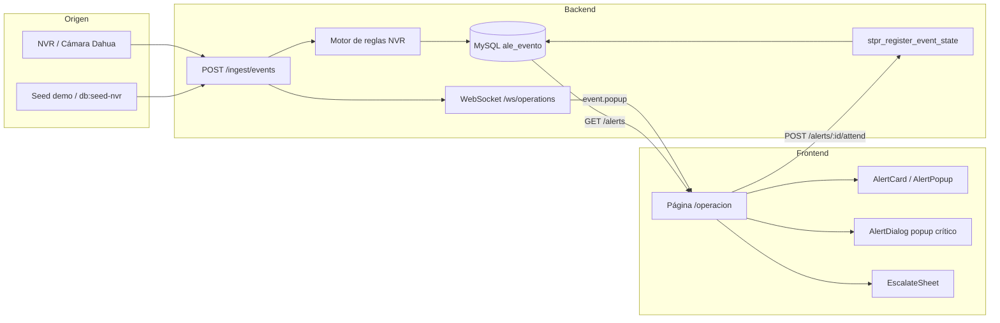
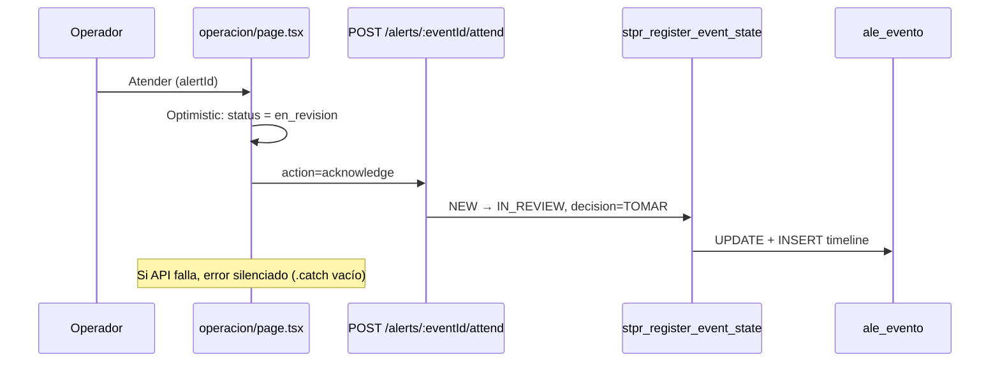
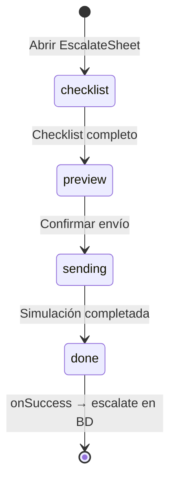

# PRD de producto — TNS CCTV PWA (estado actual del código)

> **Propósito de este documento:** punto de entrada para un tercero que evalúa el proyecto. Resume qué es el software, para quién, qué hace hoy (y qué no), y describe con detalle los **flujos de información que el operador del frontend sostiene al trabajar con alertas**.
>
> **Alcance:** refleja el código tal como está al **2026-06-11**, no la visión futura del MVP completo. Para detalle técnico profundo, continuar con `ARCHITECTURE.md`, `API.md`, `DATA-MODEL.md` y el resto de esta carpeta.
>
> **Documento objetivo original del producto:** `01-prd/PRD.md` (visión de negocio). Este PRD describe la **implementación existente**.

---

## 1. Resumen ejecutivo

**TNS CCTV PWA** es una consola web de operaciones de seguridad para el **Parque Industrial Agrolivo**. Permite a guardias y supervisores **recibir, priorizar, atender, escalar y cerrar alertas** generadas por cámaras y NVR (principalmente Dahua), registrar **ingresos vehiculares** en recepción, y consultar módulos auxiliares de administración, reportes y salud técnica.

El proyecto combina:

| Capa | Tecnología | Estado |
|------|------------|--------|
| Frontend | Next.js 16 (App Router), React 19, Tailwind v4, design system propio | Maduro en UX; parte de módulos aún en mock |
| Backend activo | Express 5 en `src/`, puerto 4000 | Funcional con MySQL |
| Base de datos | MySQL 9.x, esquema prefijado `tns_cctv` (36 tablas) | Modelo vivo y consumido |
| Realtime | WebSocket nativo (`ws`) en `/ws/operations` | Parcialmente conectado |
| Media / video | Assets demo en `/public/demo/` | Simulación visual, no CCTV real |

**Lectura honesta:** el **núcleo operativo de alertas** (login → listado → atender/escalar/cerrar → persistencia en BD) está integrado end-to-end. Recepción, usuarios y health parcial también. Reglas, expedientes, reportes, salud detallada, streaming real y notificaciones push siguen incompletos o en mock.

---

## 2. Problema que resuelve

En un parque industrial con decenas de cámaras perimetrales y puntos de acceso, la vigilancia pasiva (mirar grillas de video) no escala. El operador necesita:

1. **Cola priorizada** de incidentes accionables (por zona, criticidad y estado).
2. **Contexto inmediato** (tipo de evento, cámara, zona, evidencia visual).
3. **Trazabilidad** de decisiones (atendí, descarté, escalé, resolví).
4. **Escalación controlada** a roles superiores con checklist y contactos.
5. **Correlación** (futuro) entre eventos perimetrales e ingresos vehiculares.

---

## 3. Personas y roles

| Persona | Rol en la app | Ruta principal | Permisos clave |
|---------|---------------|----------------|----------------|
| Guardia de monitoreo | `vigilante` | `/operacion` | Ver y atender alertas |
| Supervisor de seguridad | `supervisor` | `/operacion`, `/reglas` | Alertas + configuración de reglas (UI mock hoy) |
| Recepcionista | `recepcion` | `/recepcion` | Registrar ingresos vehiculares |
| Admin del parque | `admin_parque` | `/admin/*` | Usuarios, cámaras, NVR (parcial mock) |
| Soporte TNS | `soporte_tns` | `/salud`, `/admin` | Salud técnica, soporte |

La matriz de permisos vive en `lib/auth.ts`. El backend resuelve permisos desde `gen_usuario_permiso` en MySQL; el frontend usa un `role` derivado para navegación y UX.

**Credenciales demo (seed):** `admin@agrolivo.cl` / `password123` (requiere MySQL y API activos).

---

## 4. Módulos del producto (estado actual)

| Módulo | Ruta | ¿Integrado con BD/API? | Notas |
|--------|------|------------------------|-------|
| Login | `/login` | Sí — `POST /auth/login` | JWT en localStorage; sesión no revalidada al recargar |
| Consola operativa | `/operacion` | **Sí — núcleo real** | Alertas desde `ale_evento`; acciones vía SP |
| Detalle de alerta | `/operacion/alerta/[id]` | **No** | `GET /alerts/:id` no existe en backend |
| Reglas | `/reglas` | **No (UI mock)** | Backend tiene `GET /rules`; la UI usa `MOCK_RULES` |
| Recepción | `/recepcion` | Parcial | CRUD real en `adm_ingreso`; tenants/ANPR en mock |
| Expedientes | `/expedientes` | No | Fallback a `mock-case-files-api.ts` |
| Reportes | `/reportes` | No | Datos estáticos en la página |
| Salud técnica | `/salud` | No (página) / Sí (header) | Top bar usa API health; página usa datos estáticos |
| Admin | `/admin/*` | Parcial | Usuarios real; zonas/cámaras/NVR mock |

---

## 5. Flujos de información del operador — Alertas

Esta sección es el corazón del documento. Describe **qué información entra, qué ve el operador, qué decide, y qué se persiste** en cada paso del flujo de alertas en `/operacion`.

### 5.1 Actores y sistemas en el flujo



### 5.2 Origen de una alerta (antes de que el operador la vea)

1. **Ingesta:** un evento entra por `POST /api/v1/ingest/events` (NVR real o script `npm run db:seed-nvr` / `demo:clean`).
2. **Idempotencia:** clave `x-idempotency-key` evita duplicados en `src_idempotencia_ingesta`.
3. **Motor de reglas:** `src/nvrPipeline.cjs` evalúa reglas activas en `ale_regla` y, si hay match, crea fila en `ale_evento` con estado `NEW`.
4. **Enriquecimiento:** el backend mapea severidad → criticidad UI (`critica` / `alta` / `media` / `baja`), zona (`zone_code`), regla asociada, cámara/fuente.
5. **Notificación realtime:** si hay match, `WsHub` emite `event.popup` con payload mínimo (`event_id`, `severity`, `is_critical`, `occurred_at`).

**Información que el operador aún no tiene:** snapshot real desde BD (`snapshot_url` suele ser `null`; la UI usa imágenes demo de `/demo/*`).

### 5.3 Carga inicial de la consola

| Paso | Componente | Acción | Datos |
|------|------------|--------|-------|
| 1 | `operacion/page.tsx` | `loadAlerts()` al montar | — |
| 2 | `lib/api.ts` | `GET /api/v1/alerts` | Bearer token desde localStorage |
| 3 | `src/mysqlStore.cjs` | `listAlerts()` | Lee `ale_evento` + última decisión de `log_evento_timeline` |
| 4 | Frontend | `setLocalAlerts(items)` | Array `Alert[]` en estado React |

**Estados UI de una alerta (`Alert.status`):**

| Estado UI | Significado operativo | Estado BD (`ale_evento.state`) |
|-----------|----------------------|----------------------------------|
| `pendiente` | Sin atender | `NEW` |
| `en_revision` | Operador tomó la alerta | `IN_REVIEW` |
| `escalada` | Escalada a roles superiores | `ESCALATING` |
| `resuelta` | Incidente confirmado/cerrado | `CLOSED` (decisión `CONFIRMED`) |
| `descartada` | Falso positivo | `CLOSED` (decisión `FALSE_POSITIVE`) |

**Clasificación de urgencia (`getAlertClass`):**
- `critica`: severidad alta o crítica (5/4 en BD).
- `baja_prioridad`: media o baja.

El operador filtra por pestañas: Activas, Críticas, En revisión, Escaladas, Resueltas, Baja prioridad, Todas. También por zona y criticidad.

### 5.4 Popup de alerta crítica (comportamiento demo)

| Paso | Trigger | Información mostrada | Persistencia |
|------|---------|---------------------|--------------|
| 1 | Tras 1,5 s de carga, si no hay flag en sessionStorage | Primera alerta `critica` + `pendiente` | `sessionStorage.tns_demo_alert_popup = '1'` |
| 2 | `AlertDialog` se abre | Snapshot demo, tabs Snapshot/Video, acciones Atender/Escalar/Descartar | Solo UX demo; no es push real |
| 3 | Realtime `event.popup` | Recarga lista completa (`loadAlerts()`) | El popup crítico depende del estado local tras reload |

**Virtud:** simula la experiencia de interrupción por alerta crítica.  
**Defecto:** no es equivalente a una notificación push en producción; el flag de sessionStorage limita a una vez por sesión de navegador.

### 5.5 Atender una alerta (acknowledge)

Flujo cuando el operador pulsa **Atender** / **Tomar alerta**:



| Campo que cambia | Antes | Después (UI) | Después (BD) |
|------------------|-------|--------------|--------------|
| `status` | `pendiente` | `en_revision` | `IN_REVIEW` |
| `assigned_to` | null | "Usuario Actual" (local) | actor en timeline |
| Vista activa | cualquiera | pestaña "En revisión" | — |

**Información que el operador sostiene:** confirma que asumió responsabilidad de revisar el incidente. La timeline en BD registra quién y cuándo (vía SP).

### 5.6 Revisión en curso — acciones disponibles

Con `status === en_revision` y regla con `can_escalate === true`, aparecen:

| Acción | Componente | Precondición | Efecto en información |
|--------|------------|--------------|----------------------|
| **Llamar** | `CallContactsPopover` | Regla define `escalation_roles` | Marca `llamada_at` en **estado React local solamente** |
| **Escalar** | `EscalateButton` → `EscalateSheet` | `llamada_at` debe existir (regla de negocio UI) | Abre flujo multi-fase |
| **Resolver** | Botones en card/popup | — | Cierra como confirmado |
| **Descartar** | Botones en card/popup | Motivo opcional | Cierra como falso positivo |

**Defecto crítico:** `llamada_at` **no se persiste en MySQL**. Si el operador recarga la página, pierde el registro de que llamó, y podría bloquearse la escalación según reglas UI.

### 5.7 Escalación (flujo multi-fase)



| Fase | Información que ve el operador | Qué ocurre en backend |
|------|-------------------------------|----------------------|
| **Checklist** | Acciones obligatorias (`ESCALATION_CHECKLIST_ACTIONS`) | Solo UI |
| **Preview** | Contactos resueltos por `getEscalationContacts()` desde usuarios reales o mock | — |
| **Sending** | Estado "enviando" por destinatario (simulado con delay) | `Notification` API del browser (no FCM) |
| **Done** | Confirmación visual | `POST /alerts/:id/attend` con `action: escalada` (vocabulario legacy en `EscalateSheet`) + `handleAlertAction('escalate')` vía `attendEvent` |

**Mapeo BD al escalar:**

| Acción | Transición SP | Decisión |
|--------|---------------|----------|
| escalate | → `ESCALATING` | `ESCALATED` |

**Información que el operador sostiene:** documenta que el incidente superó su capacidad de resolución inmediata y notificó a roles configurados en la regla. La observación de escalación se envía como `notes`/`observation`.

**Defectos:**
- Dos clientes API coexisten: `alerts.attend()` (legacy) y `alerts.attendEvent()` (canónico).
- La "entrega" de notificaciones es simulada; no hay integración SMS/email/push server-side.

### 5.8 Resolver o descartar

| Acción UI | API (`attendEvent`) | Transición BD | Decisión timeline |
|-----------|---------------------|---------------|-------------------|
| Resolver | `resolve` | → `CLOSED` | `CONFIRMED` |
| Descartar | `discard` + notes | → `CLOSED` | `FALSE_POSITIVE` |

El frontend aplica **UX optimista**: cambia estado local antes de confirmar API. Errores de red no muestran toast (`.catch(() => {})`), por lo que UI y BD pueden divergir sin feedback.

### 5.9 Reactivar alerta cerrada

| Acción | API | Transición BD |
|--------|-----|---------------|
| Reactivar | `reactivate` | `CLOSED` → `NEW` |

Limpia campos locales (`resolved_at`, `llamada_at`, etc.) y devuelve la alerta al inicio del flujo.

### 5.10 Realtime durante la operación

| Evento WS | Origen backend | Handler en UI | Información recibida |
|-----------|----------------|---------------|---------------------|
| `event.popup` | Tras ingest con match | `handleEventPopup()` → `loadAlerts()` | Solo IDs/metadatos mínimos; lista completa se refetch |
| `alert:new` | No emitido hoy | `handleNewAlert()` | Preparado pero inactivo |
| `alert:updated` | No emitido hoy | `handleAlertUpdated()` | Preparado pero inactivo |

**Conexión:** `hooks/use-realtime.ts` conecta a `ws://hostname:4000/ws/operations` (no pasa por proxy Next). Requiere token en localStorage para conectar, pero **el token no se envía al servidor WS** (sin autenticación en canal realtime).

### 5.11 Resumen: información que el operador sostiene

| Decisión operativa | ¿Visible en UI? | ¿Persiste en BD? | ¿En timeline? |
|-------------------|-----------------|------------------|---------------|
| Vi la alerta en cola | Sí (lista) | Sí (ya existía) | — |
| Tomé la alerta | Sí (`en_revision`) | Sí | Sí (`TOMAR`) |
| Llamé a contacto | Sí (`llamada_at`) | **No** | **No** |
| Escalé | Sí (`escalada`) | Sí | Sí (`ESCALATED`) |
| Resolví | Sí (`resuelta`) | Sí | Sí (`CONFIRMED`) |
| Descarté | Sí (`descartada`) | Sí | Sí (`FALSE_POSITIVE`) |
| Reactivé | Sí (`pendiente`) | Sí | Sí (`REACTIVATED`) |
| Notas / observación | Sí (campos locales) | Parcial (según acción) | En `decision_reason` / notes del SP |

---

## 6. Flujos secundarios (contexto)

### 6.1 Autenticación

1. Operador ingresa email/password en `/login`.
2. `AuthProvider` llama `POST /api/v1/auth/login`.
3. Backend valida contra `gen_usuario` (bcrypt).
4. JWT + datos de usuario en localStorage.
5. Redirección según rol (`getDefaultRoute`).

**Gap:** al recargar, la sesión se restaura desde localStorage sin validar token (`/auth/me` no existe).

### 6.2 Recepción vehicular (correlación futura)

1. Recepcionista registra ingreso → `POST /vehicle-entries` → `adm_ingreso`.
2. Selector de tenant usa `MOCK_TENANTS` (no API).
3. Cola ANPR usa `mock-anpr-detections.ts`.

La correlación alerta ↔ patente ↔ ingreso está modelada en SQL (`adm_candidato_correlacion`) pero no expuesta en UI operativa.

---

## 7. Virtudes del estado actual

1. **Núcleo operativo real:** alertas con persistencia transaccional vía stored procedure.
2. **UX madura:** design system, filtros, vistas por urgencia, popup crítico, escalación guiada.
3. **Arquitectura dual store:** mismo Express, swap in-memory/MySQL con `STORE=mysql`.
4. **Demo repetible:** `npm run demo:clean` resetea pipeline de alertas y arranca dev.
5. **Motor de reglas en ingest:** eventos NVR → reglas → alertas automáticas.
6. **Trazabilidad en BD:** timeline append-only en `log_evento_timeline`.
7. **Tests de contrato:** API, WS y workflow de escalación en `tests/`.

---

## 8. Defectos y deuda conocida

| # | Área | Descripción | Impacto |
|---|------|-------------|---------|
| 1 | API alertas | `GET /alerts/:id` ausente | Página detalle rota |
| 2 | API alertas | Dos vocabularios (`attend` vs `attendEvent`) | Riesgo de inconsistencia |
| 3 | UX operación | Errores API silenciados | UI/BD pueden divergir |
| 4 | Escalación | `llamada_at` solo en React | Pérdida al recargar |
| 5 | Notificaciones | Simulación browser, no push real | No apto producción |
| 6 | Auth | Sin middleware JWT en API | Endpoints mutables sin bearer válido |
| 7 | Auth | Sesión no revalidada | Token expirado no detectado |
| 8 | Realtime | WS sin autenticación | Canal abierto |
| 9 | Reglas | UI desconectada de `GET /rules` | Configuración no refleja BD |
| 10 | Media | Snapshots/video demo | No evidencia real NVR |
| 11 | Arquitectura | `backend/src/` PoC huérfano | Confusión para terceros |
| 12 | Documentación externa | `INSTRUCCIONES_ACCESO.md` desactualizado | Onboarding incorrecto |

---

## 9. Criterios de "listo para producción" (gap vs objetivo)

| Capacidad | Estado |
|-----------|--------|
| Login seguro con refresh/revocación | Parcial |
| Alertas E2E con evidencia real | Parcial |
| Escalación con notificación real | No |
| Reglas editables desde UI con persistencia | No |
| Streaming CCTV en vivo | No |
| Correlación ingreso ↔ evento | No en UI |
| Auditoría API persistente | Modelada en SQL, no cableada |
| Tests CI confiables | Inestable (`npm test`) |
| Un solo backend fuente de verdad | No (`src/` vs `backend/src/`) |

---

## 10. Cómo arrancar el sistema (para evaluación)

```bash
# Desde la raíz del repo
pnpm install

# Requiere MySQL con esquema tns_cctv y db/connection-config.json
npm run demo:clean   # reset alertas + seed + dev (API :4000 + Web :3000)

# O por separado:
npm run dev:api      # STORE=mysql PORT=4000
npm run dev:web      # Next :3000
```

Login: `admin@agrolivo.cl` / `password123`  
Consola: http://localhost:3000/operacion

---

## 11. Mapa de documentación en `02-design/`

| Documento | Contenido |
|-----------|-----------|
| **PRD-PRODUCTO.md** (este) | Visión, flujos operador, estado honesto |
| `ARCHITECTURE.md` | Capas, fuentes de verdad, divergencias |
| `API.md` | Endpoints reales y gaps |
| `DATA-MODEL.md` | Modelo SQL prefijado |
| `DATABASE-SPEC.md` | Orquestador, SP, reglas de ejecución |
| `SECURITY.md` | Auth, RBAC, gaps de hardening |
| `STREAMING.md` | Estado demo de media |
| `SPRINT-PLAN.md` | Tablero de avance y prioridades |

---

**Última actualización basada en código:** 2026-06-11  
**Rama de referencia:** `integracion/funcionalidad-escalar-ddbb_inicial`
